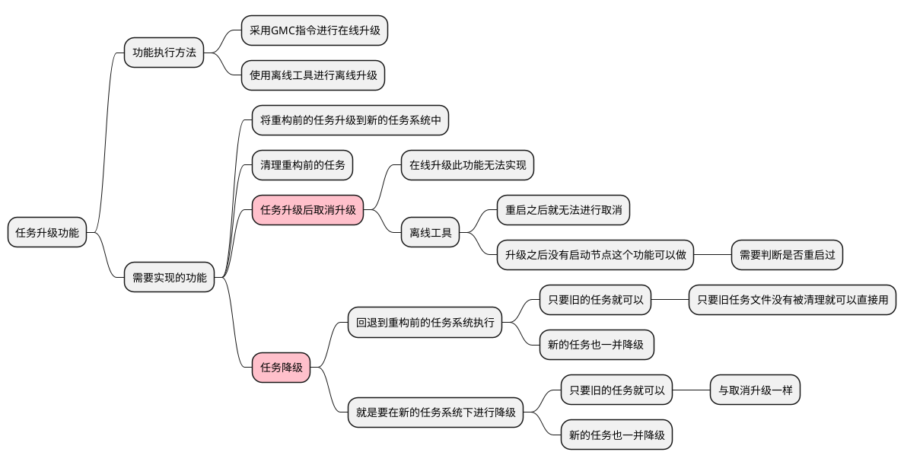
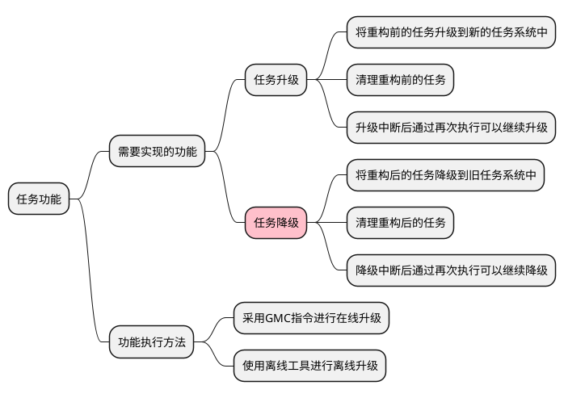
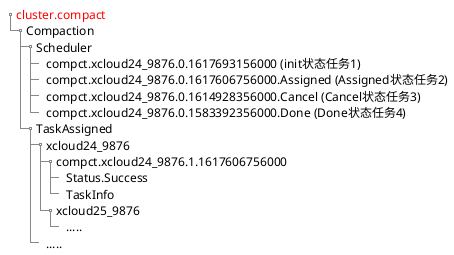
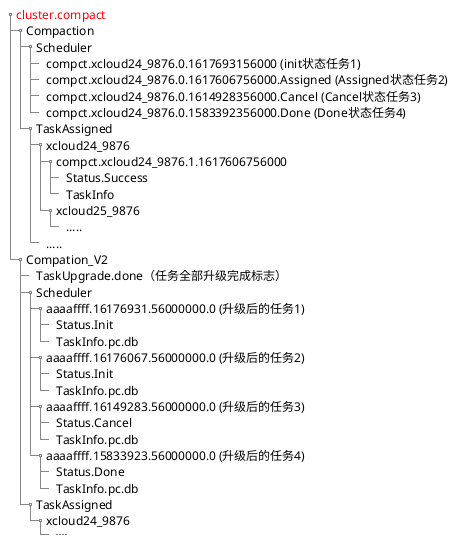
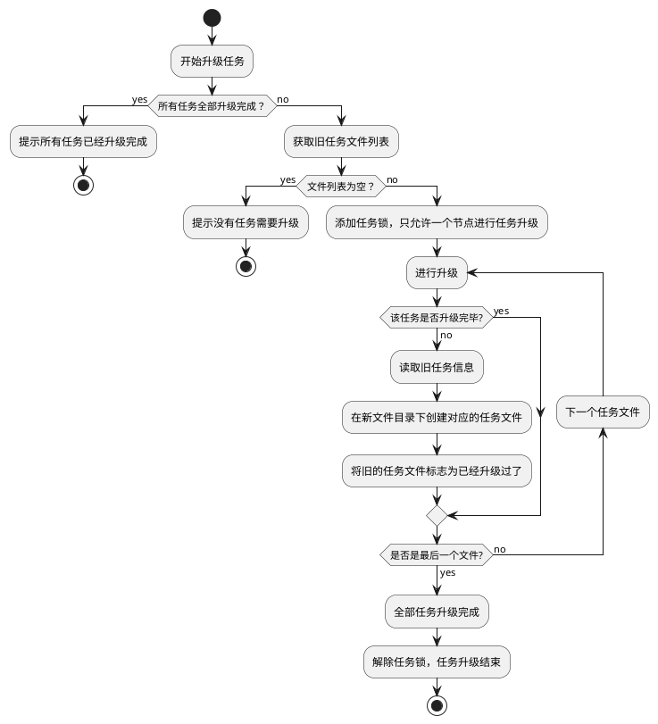
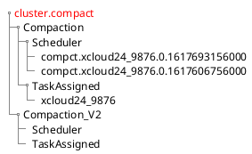
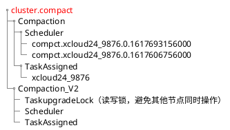
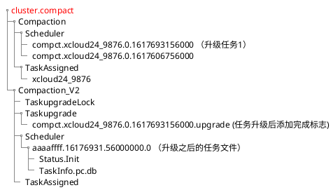
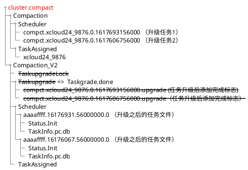
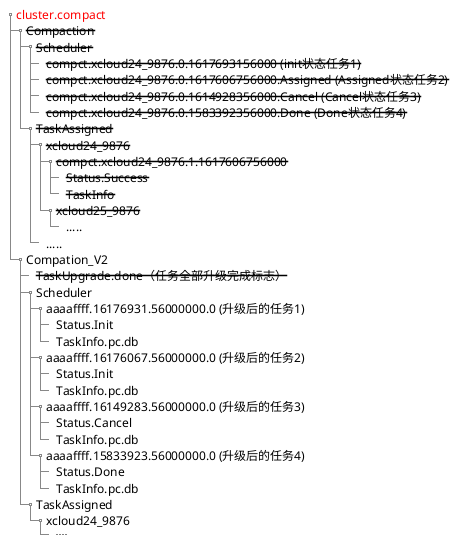

任务升级方案思维导图

 

任务升级方案思维导图

 

重构前的任务文件目录结构

 

升级之后预期的任务文件目录结构

 

 

下发升级指令前,假设有两个任务需要升级

 

需要创建读写锁保证只有一个节点操作（使用离线工具可以不用考虑？）

 

升级任务1，读取任务，在新的任务系统中添加新的任务文件，任务文件升级之后
添加标志表示该任务升级完成，这是为了保证升级过程中如果有某个任务失败，再次下发升级命令
可以跳过已经升级完成的任务继续升级

 

全部任务都升级完成以后，先将小的标志位去掉，之后将Taskupgrade改为Taskupgrade.done
表示升级全部完成，之后再下发升级指令，检测到这个标志之后就不进行升级
最后删除TaskupgradeLock这个读写锁

 

删除指令将原始的任务文件以及一些辅助的标志文件删除

 