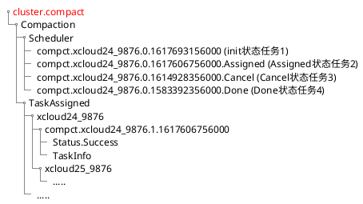
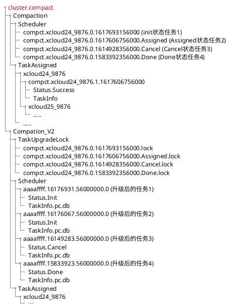
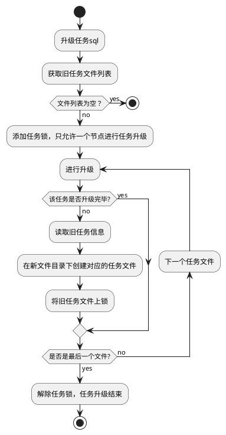
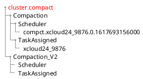
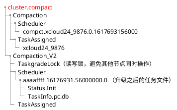
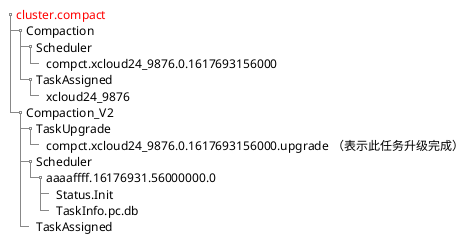
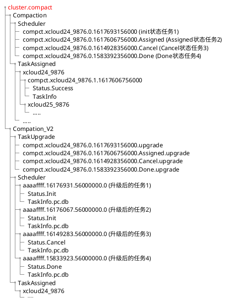
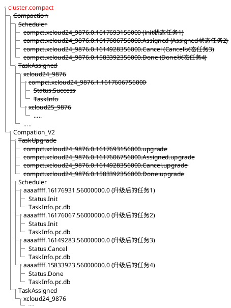
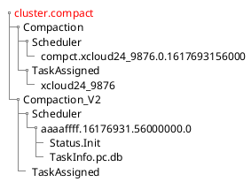

重构前的任务文件目录结构

```plantuml
@startsalt
{
{T
 + <color:red>cluster.compact
 ++ Compaction
 +++ Scheduler
 ++++ compct.xcloud24_9876.0.1617693156000 (init状态任务1)
 ++++ compct.xcloud24_9876.0.1617606756000.Assigned (Assigned状态任务2)
 ++++ compct.xcloud24_9876.0.1614928356000.Cancel (Cancel状态任务3)
 ++++ compct.xcloud24_9876.0.1583392356000.Done (Done状态任务4)
 +++ TaskAssigned
 ++++ xcloud24_9876
 +++++ compct.xcloud24_9876.1.1617606756000
 ++++++ Status.Success
 ++++++ TaskInfo
 +++++ xcloud25_9876
 ++++++ .....
 ++++ .....
}
}
@endsalt
```
 

升级之后预期的任务文件目录结构

```plantuml
@startsalt
{
{T
 + <color:red>cluster.compact
 ++ Compaction
 +++ Scheduler
 ++++ compct.xcloud24_9876.0.1617693156000 (init状态任务1)
 ++++ compct.xcloud24_9876.0.1617606756000.Assigned (Assigned状态任务2)
 ++++ compct.xcloud24_9876.0.1614928356000.Cancel (Cancel状态任务3)
 ++++ compct.xcloud24_9876.0.1583392356000.Done (Done状态任务4)
 +++ TaskAssigned
 ++++ xcloud24_9876
 +++++ compct.xcloud24_9876.1.1617606756000
 ++++++ Status.Success
 ++++++ TaskInfo
 +++++ xcloud25_9876
 ++++++ .....
 ++++ .....
 ++ Compation_V2
 +++ TaskUpgradeLock
 ++++ compct.xcloud24_9876.0.1617693156000.lock
 ++++ compct.xcloud24_9876.0.1617606756000.Assigned.lock
 ++++ compct.xcloud24_9876.0.1614928356000.Cancel.lock
 ++++ compct.xcloud24_9876.0.1583392356000.Done.lock
 +++ Scheduler
 ++++ aaaaffff.16176931.56000000.0 (升级后的任务1)
 +++++ Status.Init
 +++++ TaskInfo.pc.db
 ++++ aaaaffff.16176067.56000000.0 (升级后的任务2)
 +++++ Status.Init
 +++++ TaskInfo.pc.db
 ++++ aaaaffff.16149283.56000000.0 (升级后的任务3)
 +++++ Status.Cancel
 +++++ TaskInfo.pc.db
 ++++ aaaaffff.15833923.56000000.0 (升级后的任务4)
 +++++ Status.Done
 +++++ TaskInfo.pc.db
 +++ TaskAssigned
 ++++ xcloud24_9876
 +++++ ....
}
}
@endsalt
```
 

```plantuml
@startuml

start
:升级任务sql;

:获取旧任务文件列表;
if(文件列表为空？) then (yes)
stop
else (no)
	:添加任务锁，只允许一个节点进行任务升级;
	repeat:进行升级 
		if (该任务是否升级完毕?) then (yes)
		else (no)
			:读取旧任务信息;
			:在新文件目录下创建对应的任务文件;
			:将旧任务文件上锁;
		endif
		backward:下一个任务文件;
	repeat while (是否是最后一个文件?)is(no) not(yes)

:解除任务锁，任务升级结束;
stop

@enduml
```
 

下发升级指令前

```plantuml
@startsalt
{
{T
 + <color:red>cluster.compact
 ++ Compaction
 +++ Scheduler
 ++++ compct.xcloud24_9876.0.1617693156000 
 +++ TaskAssigned
 ++++ xcloud24_9876
 ++ Compaction_V2
 +++ Scheduler
 +++ TaskAssigned
}
}
@endsalt
```
 

下发升级指令-读取旧任务，创建新任务，需要创建读写锁

```plantuml
@startsalt
{
{T
 + <color:red>cluster.compact
 ++ Compaction
 +++ Scheduler
 ++++ compct.xcloud24_9876.0.1617693156000 
 +++ TaskAssigned
 ++++ xcloud24_9876
 ++ Compaction_V2
 +++ TaskgradeLock（读写锁，避免其他节点同时操作）
 +++ Scheduler
 ++++ aaaaffff.16176931.56000000.0 （升级之后的任务文件）
 +++++ Status.Init
 +++++ TaskInfo.pc.db
 +++ TaskAssigned
}
}
@endsalt
```
 

下发升级指令-任务创建完成后生成文件，表示此任务升级完成

```plantuml
@startsalt
{
{T
 + <color:red>cluster.compact
 ++ Compaction
 +++ Scheduler
 ++++ compct.xcloud24_9876.0.1617693156000 
 +++ TaskAssigned
 ++++ xcloud24_9876
 ++ Compaction_V2
 +++ TaskUpgrade
 ++++ compct.xcloud24_9876.0.1617693156000.upgrade （表示此任务升级完成）
 +++ Scheduler
 ++++ aaaaffff.16176931.56000000.0 
 +++++ Status.Init
 +++++ TaskInfo.pc.db
 +++ TaskAssigned
}
}
@endsalt
```
 

升级之后预期的任务文件目录结构

```plantuml
@startsalt
{
{T
 + <color:red>cluster.compact
 ++ Compaction
 +++ Scheduler
 ++++ compct.xcloud24_9876.0.1617693156000 (init状态任务1)
 ++++ compct.xcloud24_9876.0.1617606756000.Assigned (Assigned状态任务2)
 ++++ compct.xcloud24_9876.0.1614928356000.Cancel (Cancel状态任务3)
 ++++ compct.xcloud24_9876.0.1583392356000.Done (Done状态任务4)
 +++ TaskAssigned
 ++++ xcloud24_9876
 +++++ compct.xcloud24_9876.1.1617606756000
 ++++++ Status.Success
 ++++++ TaskInfo
 +++++ xcloud25_9876
 ++++++ .....
 ++++ .....
 ++ Compation_V2
 +++ TaskUpgrade
 ++++ compct.xcloud24_9876.0.1617693156000.upgrade
 ++++ compct.xcloud24_9876.0.1617606756000.Assigned.upgrade
 ++++ compct.xcloud24_9876.0.1614928356000.Cancel.upgrade
 ++++ compct.xcloud24_9876.0.1583392356000.Done.upgrade
 +++ Scheduler
 ++++ aaaaffff.16176931.56000000.0 (升级后的任务1)
 +++++ Status.Init
 +++++ TaskInfo.pc.db
 ++++ aaaaffff.16176067.56000000.0 (升级后的任务2)
 +++++ Status.Init
 +++++ TaskInfo.pc.db
 ++++ aaaaffff.16149283.56000000.0 (升级后的任务3)
 +++++ Status.Cancel
 +++++ TaskInfo.pc.db
 ++++ aaaaffff.15833923.56000000.0 (升级后的任务4)
 +++++ Status.Done
 +++++ TaskInfo.pc.db
 +++ TaskAssigned
 ++++ xcloud24_9876
 +++++ ....
}
}
@endsalt
```
 

```plantuml
@startsalt
{
{T
 + <color:red>cluster.compact
 ++ <s>Compaction
 +++ <s>Scheduler
 ++++ <s>compct.xcloud24_9876.0.1617693156000 (init状态任务1)
 ++++ <s>compct.xcloud24_9876.0.1617606756000.Assigned (Assigned状态任务2)
 ++++ <s>compct.xcloud24_9876.0.1614928356000.Cancel (Cancel状态任务3)
 ++++ <s>compct.xcloud24_9876.0.1583392356000.Done (Done状态任务4)
 +++ <s>TaskAssigned
 ++++ <s>xcloud24_9876
 +++++ <s>compct.xcloud24_9876.1.1617606756000
 ++++++ <s>Status.Success
 ++++++ <s>TaskInfo
 +++++ <s>xcloud25_9876
 ++++++ .....
 ++++ .....
 ++ Compation_V2
 +++ <s>TaskUpgrade
 ++++ <s>compct.xcloud24_9876.0.1617693156000.upgrade
 ++++ <s>compct.xcloud24_9876.0.1617606756000.Assigned.upgrade
 ++++ <s>compct.xcloud24_9876.0.1614928356000.Cancel.upgrade
 ++++ <s>compct.xcloud24_9876.0.1583392356000.Done.upgrade
 +++ Scheduler
 ++++ aaaaffff.16176931.56000000.0 (升级后的任务1)
 +++++ Status.Init
 +++++ TaskInfo.pc.db
 ++++ aaaaffff.16176067.56000000.0 (升级后的任务2)
 +++++ Status.Init
 +++++ TaskInfo.pc.db
 ++++ aaaaffff.16149283.56000000.0 (升级后的任务3)
 +++++ Status.Cancel
 +++++ TaskInfo.pc.db
 ++++ aaaaffff.15833923.56000000.0 (升级后的任务4)
 +++++ Status.Done
 +++++ TaskInfo.pc.db
 +++ TaskAssigned
 ++++ xcloud24_9876
 +++++ ....
}
}
@endsalt
```
 

下发升级指令前

```plantuml
@startsalt
{
{T
 + <color:red>cluster.compact
 ++ Compaction
 +++ Scheduler
 ++++ compct.xcloud24_9876.0.1617693156000 
 +++ TaskAssigned
 ++++ xcloud24_9876
 ++ Compaction_V2
 +++ Scheduler
 +++ TaskAssigned
}
}
@endsalt
```
 

下发升级指令-读取旧任务，创建新任务

```plantuml
@startsalt
{
{T
 + <color:red>cluster.compact
 ++ Compaction
 +++ Scheduler
 ++++ compct.xcloud24_9876.0.1617693156000 
 +++ TaskAssigned
 ++++ xcloud24_9876
 ++ Compaction_V2
 +++ Scheduler
 ++++ aaaaffff.16176931.56000000.0 
 +++++ Status.Init
 +++++ TaskInfo.pc.db
 +++ TaskAssigned
}
}
@endsalt
```
 