任务升级方案思维导图
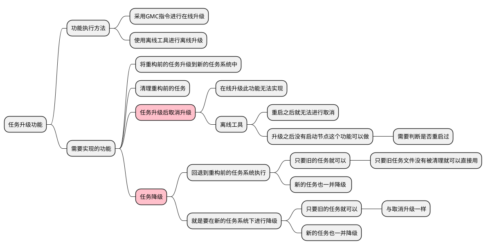
<br>

任务升级方案思维导图
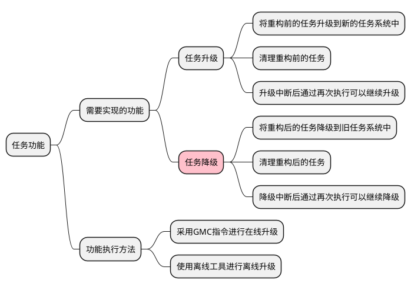
<br>

重构前的任务文件目录结构
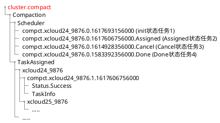
<br>

升级之后预期的任务文件目录结构
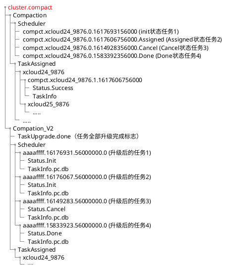
<br>

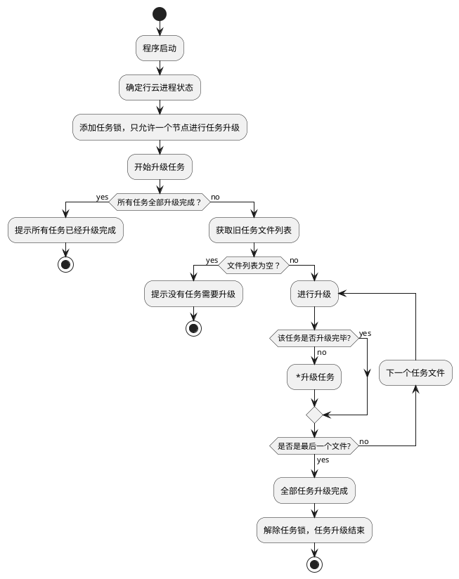
<br>

任务升级具体文件操作
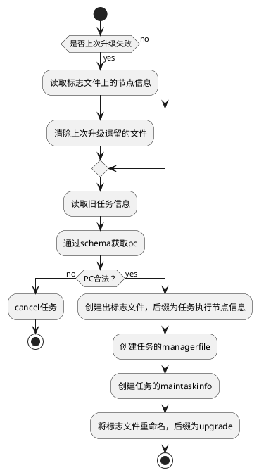
<br>

下发升级指令前,假设有两个任务需要升级
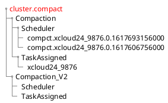
<br>

需要创建读写锁保证只有一个节点操作（使用离线工具可以不用考虑？）
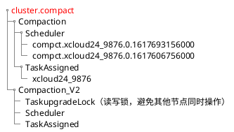
<br>

升级任务1，读取任务，在新的任务系统中添加新的任务文件，任务文件升级之后
添加标志表示该任务升级完成，这是为了保证升级过程中如果有某个任务失败，再次下发升级命令
可以跳过已经升级完成的任务继续升级
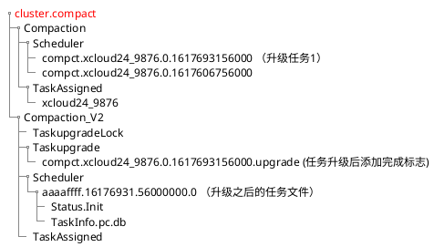
<br>

全部任务都升级完成以后，先将小的标志位去掉，之后将Taskupgrade改为Taskupgrade.done
表示升级全部完成，之后再下发升级指令，检测到这个标志之后就不进行升级
最后删除TaskupgradeLock这个读写锁
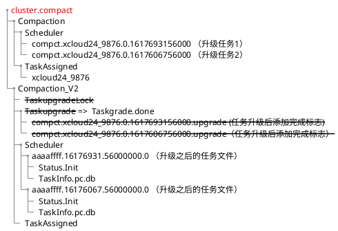
<br>

删除指令将原始的任务文件以及一些辅助的标志文件删除
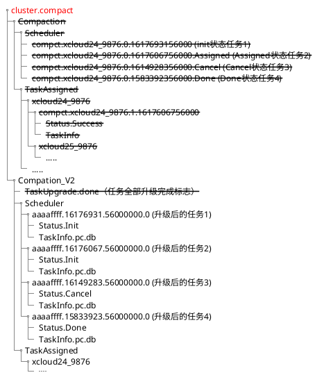
<br>

升级任务后PC信息的指定方式
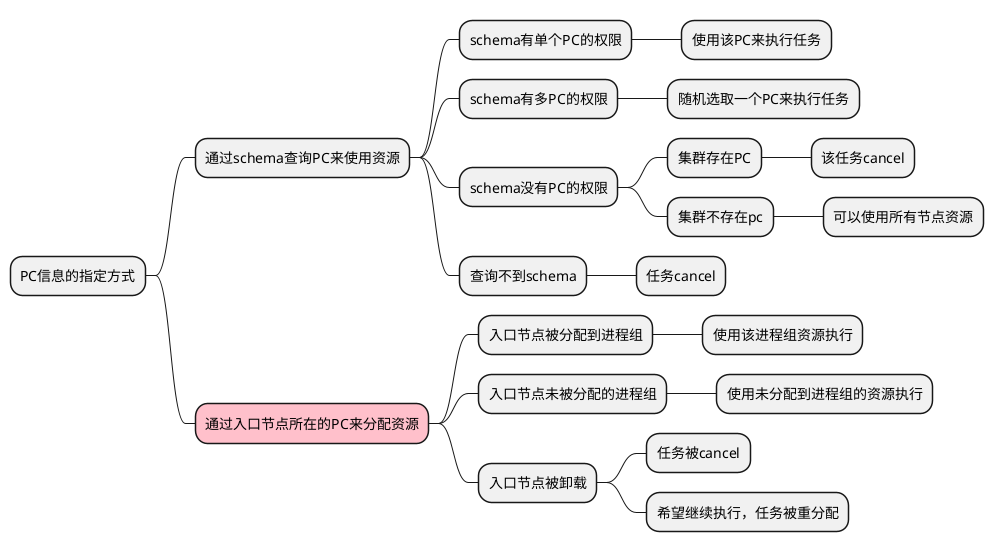
<br>

任务升级方案思维导图
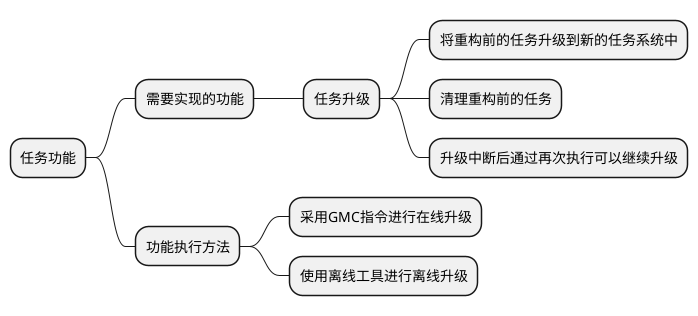
<br>

旧任务内容：
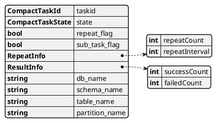
<br>

新任务内容：
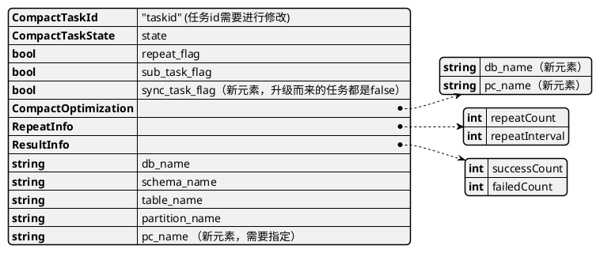

<br>

任务升级失败方案思维导图
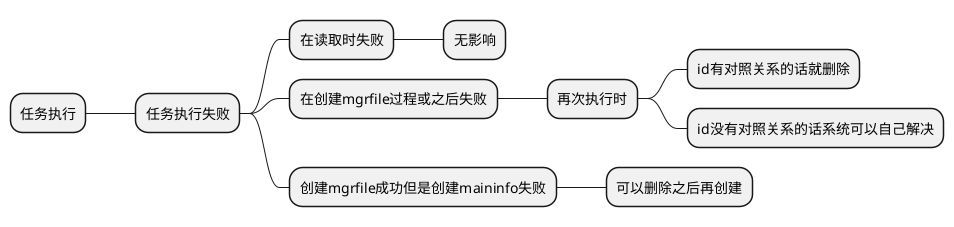
<br>

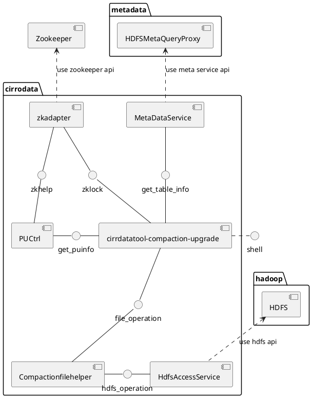
<br>

启动离线工具进行任务升级
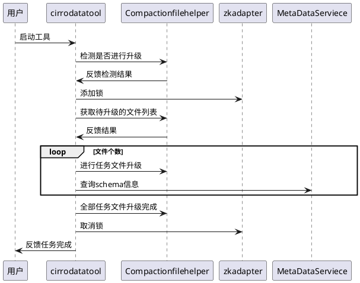

<br>

启动离线工具进行任务删除
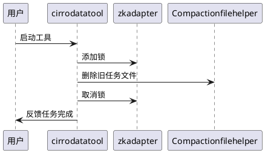
<br>

cirrdatatool-compaction-upgrade二级模块
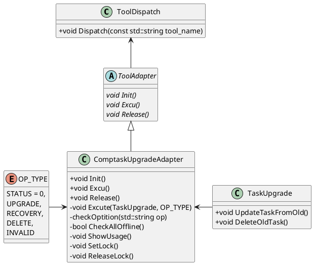
<br>

任务升级运行视图
```plantuml
@startuml
activate ToolDispatch
ToolDispatch-> ToolDispatch : 注册ComptaskUpgradeAdapter
ToolDispatch -> ComptaskUpgradeAdapter :  Init
activate ComptaskUpgradeAdapter
ComptaskUpgradeAdapter -> PUCtrl : CheckAllOffline
ComptaskUpgradeAdapter -> ZKAdapoter: SetLock
ToolDispatch -> ComptaskUpgradeAdapter :  Excu
ComptaskUpgradeAdapter -> ComptaskUpgradeAdapter : checkOptition
ComptaskUpgradeAdapter -> TaskUpgrade : Excute
activate TaskUpgrade
alt UPGRADE
TaskUpgrade -> TaskUpgrade:UpdateTaskFromOld
else DELETE
TaskUpgrade -> TaskUpgrade:DeleteOldTask
end
TaskUpgrade -> ComptaskUpgradeAdapter: exit
deactivate TaskUpgrade
ComptaskUpgradeAdapter -> ZKAdapoter: ReleaseLock
ComptaskUpgradeAdapter -> ToolDispatch : exit
ToolDispatch -> ComptaskUpgradeAdapter: release
@enduml
```
<br>

compaction_file_helper二级模块
```plantuml
@startuml
skinparam classAttributeIconSize 0
class TaskUpgrade {
	-CompManagerFileHelper* managerfile_helper_
    -CompMainTaskFileHelper* maintaskfile_helper_
    -CompMainTaskFileHelperV1* maintaskfile_v1_helper_
    -UpgradeMarkFileHelper* upgrade_markfile_helper
    +void UpdateTaskFromOld()
    +void DeleteOldTask()
    -void SetLock()
    -void ReleaseLock()
}
class CompMainTaskFileHelperV1 {
	-hdfsa::IHdfsAccessService* hdfs_
	CompactTaskState GetTaskStateFromFileName()
	bool GetMainTaskInfo()
	bool GetAllMainTaskFromScheduler()
	void ClearAllTaskV1File()
}
class CompMainTaskFileHelper {
	-hdfsa::IHdfsAccessService* hdfs_
	bool CreateMainTask()
	bool DeleteMaintask()

}
class CompManagerFileHelper {
	-hdfsa::IHdfsAccessService* hdfs_
	bool CreateMaintaskMgr()
	bool DeleteMaintaskMgr()
}
Class CompactMainTaskInfoV1 {
void UpgradeMainTaskInfo()
}
Class CompactMainTaskInfoV2 {

}
Class UpgradeMarkFileHelper {
	-hdfsa::IHdfsAccessService* hdfs_
	void MarkUpgradingFile()
	void MarkUpgradedFile()
	bool IfUpgraded()
	void UnMarkUpgradeFile()
	void MarkAllFileUpgrade()
	void ClearAllFileUpgradeMark()
}
  
TaskUpgrade .> CompMainTaskFileHelper
TaskUpgrade ..> CompManagerFileHelper
UpgradeMarkFileHelper <. TaskUpgrade
CompMainTaskFileHelperV1 <.. TaskUpgrade
CompMainTaskFileHelperV1 .> CompactMainTaskInfoV1
CompMainTaskFileHelper .> CompactMainTaskInfoV2
CompManagerFileHelper .> CompactMainTaskInfoV2
CompactMainTaskInfoV1 ..> CompactMainTaskInfoV2
@enduml
```
<br>

任务升级运行视图--文件操作
```plantuml
@startuml
activate TaskUpgrade
alt UPGRADE
	TaskUpgrade -> TaskUpgrade: UpdateTaskFromOld
	activate TaskUpgrade
	TaskUpgrade -> CompMainTaskFileHelperV1 : GetAllMainTaskFromScheduler
	CompMainTaskFileHelperV1 -> TaskUpgrade : all maintask filelist
	loop filelist
		TaskUpgrade -> UpgradeMarkFileHelper : IfUpgraded
		UpgradeMarkFileHelper -> TaskUpgrade : result
		alt Unupgrade
			TaskUpgrade->CompMainTaskFileHelperV1 : GetMainTaskInfo
			TaskUpgrade<-CompMainTaskFileHelperV1 : task info
			activate TaskUpgrade
			TaskUpgrade -> CompactMainTaskInfoV1 : UpgradeMainTaskInfo
			deactivate TaskUpgrade
			TaskUpgrade -> CompMainTaskFileHelper : CreateMainTask
			alt Init Running
				TaskUpgrade -> CompManagerFileHelper : CreateMaintaskMgr
			end
		else Upgrade	
		end
	end
	deactivate TaskUpgrade
else DELETE
	TaskUpgrade -> TaskUpgrade: DeleteOldTask
	activate TaskUpgrade
	TaskUpgrade -> CompMainTaskFileHelperV1 : DeleteAllTask
	TaskUpgrade -> UpgradeMarkFileHelper : ClearAllFileUpgradeMark
end
@enduml
```


<br>

任务升级运行视图--公共数据类型
```plantuml
@startuml
object CompactTaskId {
	std::string：query_id_
	int：sequence_no_
}
object CompactTaskIdV1 {
    std::string m_receive_pu
    int m_sequence_no
    uint64_t m_receive_ts
}
object ResultInfo {
    uint m_successCount
    uint m_failedCount
}
object RepeatInfo {
    int m_repeatCount
    int m_repeatInterval
}
object CompactOptimization {
    std::string db_name_
    std::string pc_name_
}
object TaskMemo {
    int64_t compact_filesize_threshold
    int compact_group_num
}
object CompactTaskInfoDataV1 {
    CompactTaskIdV1 _task_id
    CompactTaskState _state
    bool _repeat_flag
    bool _sub_task_flag
    RepeatInfo _repeat_info
    ResultInfo _result_info
    std::string _db_name
    std::string _schema_name
    std::string _table_name
    std::string _partition_name
}
object CompactTaskInfoDataV2 {
    CompactTaskId task_id
    std::string receive_pu
    CompactTaskState state
    CompactOptimization optimizat
    bool repeat_flag
    bool sub_task_flag
    bool sync_task_flag
    RepeatInfo repeat_info
    ResultInfo result_info
    std::string db_name
    std::string schema_name
    std::string table_name
    std::string partition_name
    std::string pc_name
    std::string executenode
    TaskMemo memo
}
CompactTaskInfoDataV1 -> CompactTaskIdV1
CompactTaskInfoDataV1 --> ResultInfo
CompactTaskInfoDataV1 --> RepeatInfo
CompactTaskId <-- CompactTaskInfoDataV2
ResultInfo <-- CompactTaskInfoDataV2
RepeatInfo <-- CompactTaskInfoDataV2
CompactTaskInfoDataV2 -> CompactOptimization
TaskMemo <- CompactTaskInfoDataV2 
@enduml

```