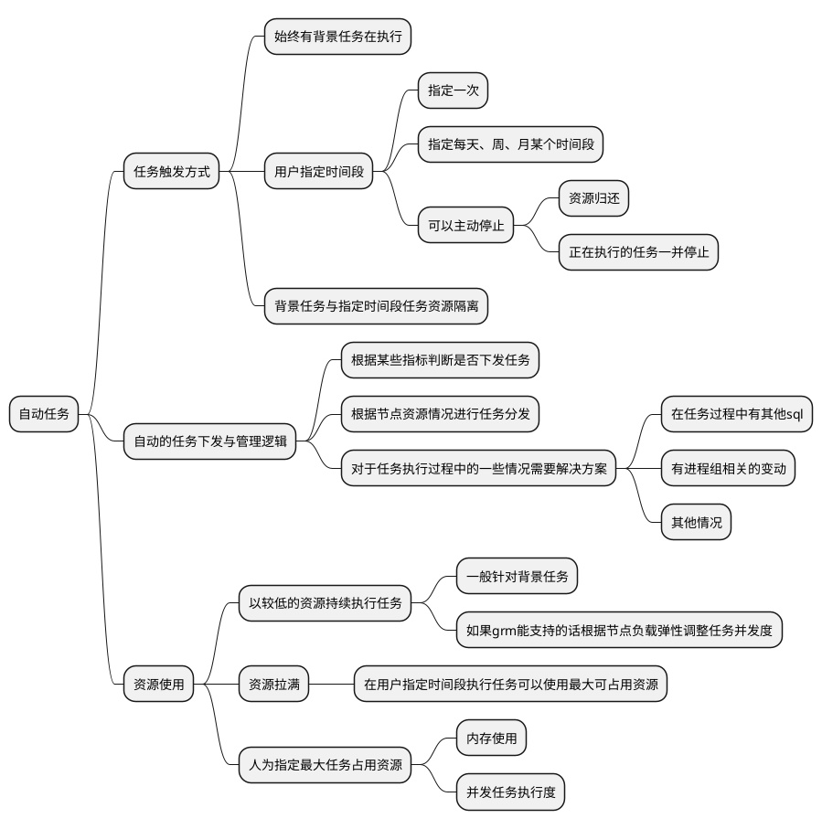

<!--
 * @FilePath: /github/harpseal/东方国信工作资料/compaction/compaction自动任务方案.md
 * @Author: harpseal
 * @Date: 2023-03-23 09:52:40
 * @LastEditTime: 2023-03-23 10:42:14
 * @email: 844291270@qq.com
-->

```plantuml
@startmindmap
* 自动任务
++ 任务触发方式
+++ 始终有背景任务在执行
+++ 用户指定时间段
++++ 指定一次
++++ 指定每天、周、月某个时间段
++++ 可以主动停止
+++++ 资源归还
+++++ 正在执行的任务一并停止
+++ 背景任务与指定时间段任务资源隔离
++ 自动的任务下发与管理逻辑
+++ 根据某些指标判断是否下发任务
+++ 根据节点资源情况进行任务分发
+++ 对于任务执行过程中的一些情况需要解决方案
++++ 在任务过程中有其他sql
++++ 有进程组相关的变动
++++ 其他情况
++ 资源使用
+++ 以较低的资源持续执行任务
++++ 一般针对背景任务
++++ 如果grm能支持的话根据节点负载弹性调整任务并发度
+++ 资源拉满
++++ 在用户指定时间段执行任务可以使用最大可占用资源
+++ 人为指定最大任务占用资源
++++ 内存使用
++++ 并发任务执行度

@endmindmap
```