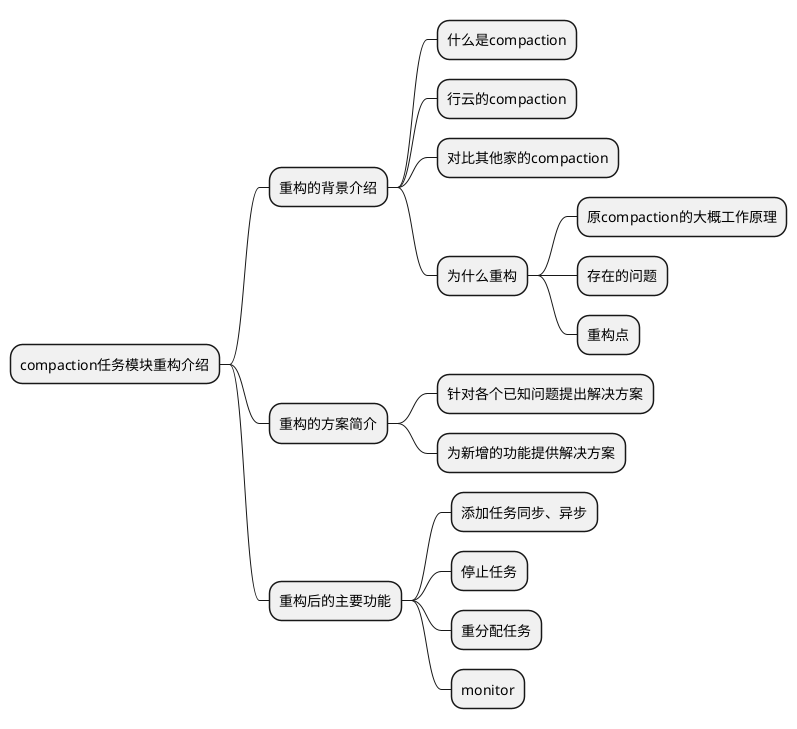

```plantuml
@startmindmap
* compaction任务模块重构介绍
** 重构的背景介绍
*** 什么是compaction
*** 行云的compaction
*** 对比其他家的compaction
*** 为什么重构
**** 原compaction的大概工作原理
**** 存在的问题
**** 重构点

** 重构的方案简介
*** 针对各个已知问题提出解决方案
*** 为新增的功能提供解决方案

** 重构后的主要功能
*** 添加任务同步、异步
*** 停止任务
*** 重分配任务
*** monitor
@endmindmap
```