compaction任务模块重构：
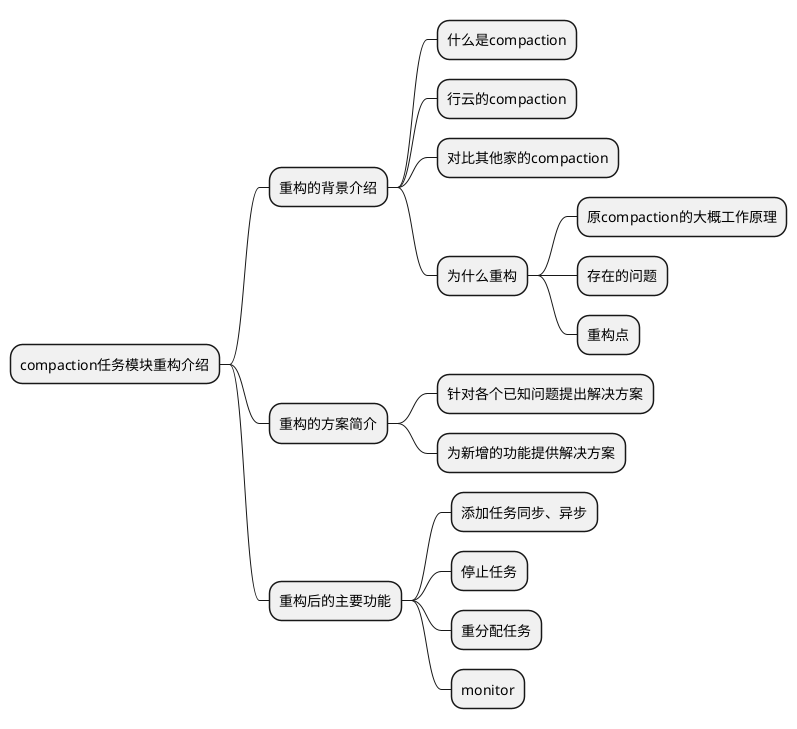
程序启动时，所有节点参与leader选举
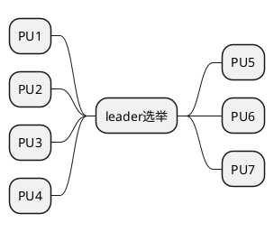
<br>

leader选举结束后PU1为leader，其他节点为worker
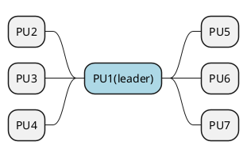
<br>

在PU6节点下发compaction任务，leader节点获取任务信息，生成主任务
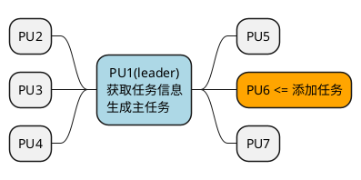
<br>

leader节点根据table下的分区个数，创建子任务，分配到各个worker节点
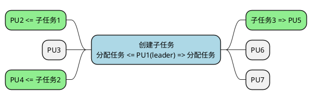
<br>

各个worker节点处理任务，leader监控子任务执行情况并更新主任务信息
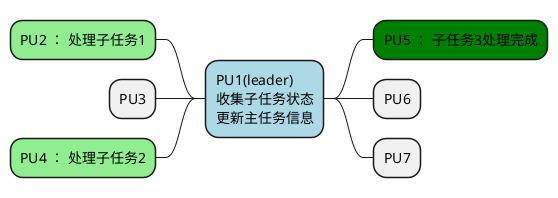
<br>

leader检测所有子任务都完成后，leader节点修改主任务状态为完成并删除子任务
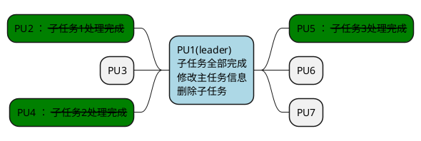
<br>

如果在任务执行过程中有节点离线，就由leader对这个节点下的任务进行重分配（一致性hash）
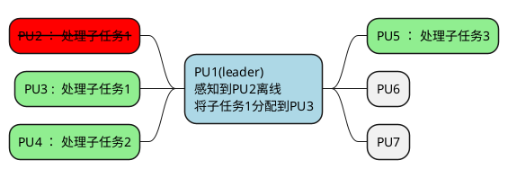
<br>

如果leader节点出问题了，则其他节点需要进行leader选举，选举期间不需要暂停子任务处理
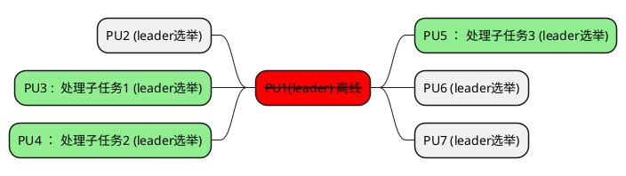
<br>

leader选举结束后，由新的leader行使职能
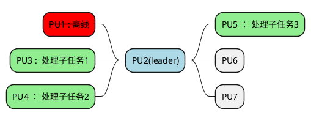
<br>

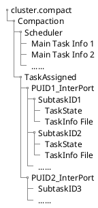
<br>

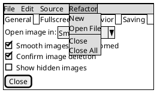
<br>

集群启动时进行leader（monitor）选举
（依托job_scheduler模块）
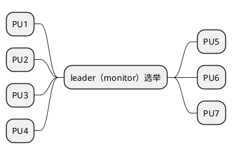
<br>

选举出的monitor节点定时执行维护历史信息与离线节点任务重分配的功能
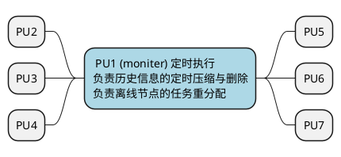
<br>

向PU6添加任务，则PU6成为该任务的manager，负责子任务的分配
子任务执行结果收集，与主任务状态的维护
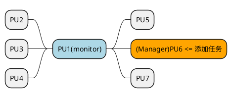
<br>


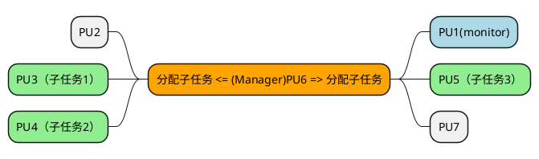
<br>

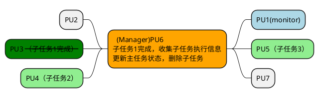
<br>

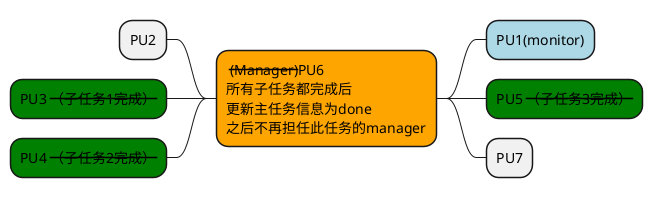
<br>

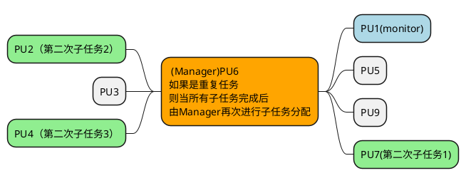
<br>

不同的任务Manager节点可以不同，各自维护属于自己的主任务逻辑
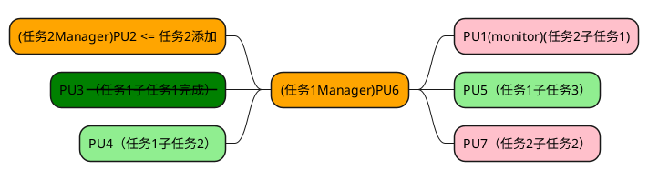
<br>

当有节点离线时，monitor会进行监控，如果该节点下只有子任务
monitor不做处理，但所属的Manger节点在收集子任务状态时如果检测到节点离线
认为该节点执行任务失败
```plantuml
@startmindmap
*[#lightblue]: PU1(monitor)
monitor不做处理;
-- PU2 
--[#lightgreen]  PU3（子任务1）
--[#lightgreen]  PU4 (子任务2)
++[#red] <s>PU5离线 (子任务3) </s>
++[#Orange] (Manager)PU6 认为子任务3执行失败
++ PU7
@endmindmap
```
<br>

如果离线节点下存在manager任务，monitor节点会将其进行重分配
```plantuml
@startmindmap
*[#lightblue]: PU1(monitor)
每小时执行一次重分配检测
检测到PU6离线
将Manager重新分配到PU2;
--[#orange] (Manager)PU2
--[#lightgreen]  PU3（子任务1）
--[#lightgreen]  PU4 (子任务2)
++[#lightgreen]  PU5 (子任务3) 
++[#red] <s>(Manager)PU6离线</s>
++ PU7
@endmindmap
```
如果没有满足的重分配节点（基本上就是整个pc下线了这个情景），那么这个任务会被标记为cancel

<br>


```plantuml
@startsalt
{
{T
 + <color:red>cluster.compact
 ++ Compaction_v2
 +++ Scheduler
 ++++ MainTask1 Id
 +++++ TaskState
 +++++ TaskInfo File
 ++++ MainTask2 Id
 +++++ TaskState
 +++++ TaskInfo File
 ++++ ......
 ++++ Compress
 +++++ Time1 Compressfile
 +++++ Time2 Compressfile
 +++++ .......
 +++ TaskAssigned
 ++++ PUID1_InterPort
 +++++ SubtaskID1
 ++++++ TaskState
 ++++++ TaskInfo File
 +++++ SubtaskID2
 ++++++ TaskState
 ++++++ TaskInfo File
 +++++ ......
 ++++ PUID2_InterPort
 +++++ SubtaskID3
 +++++ ......
}
}
@endsalt
```
<br>

```plantuml
@startyaml
CompactTaskId: "taskid"
CompactTaskState: "state"
bool: repeat_flag
bool: sub_task_flag
RepeatInfo: 
	int: repeatCount
	int: repeatInterval
ResulttInfo:
	int: successCount
	int: failedCount
string: db_name
string: schema_name
string: table_name
string: partition_name
@endyaml
```
<br>

