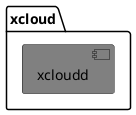

# 第零层分解1

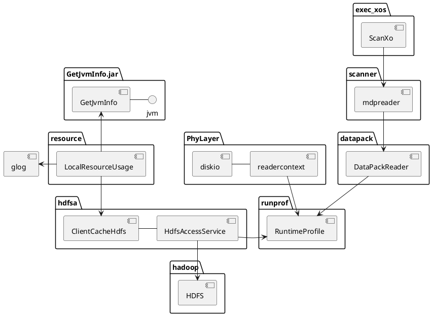

# 第零层分解2

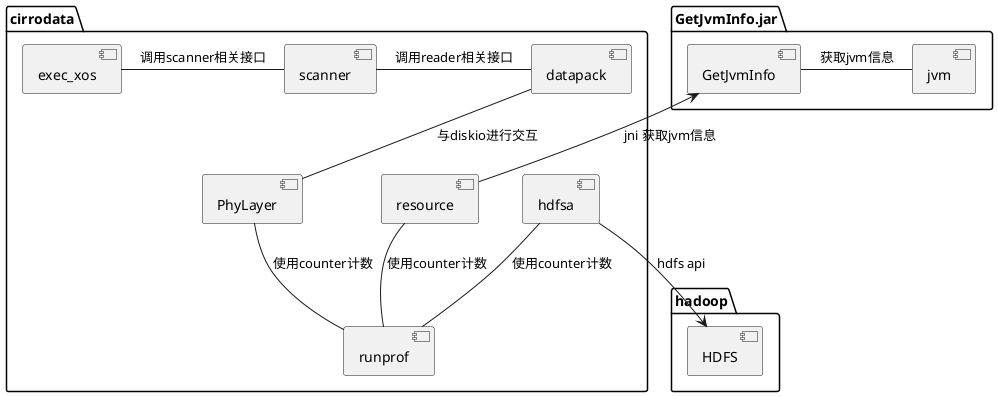

# 图例
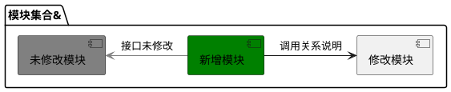
# 第一级分解
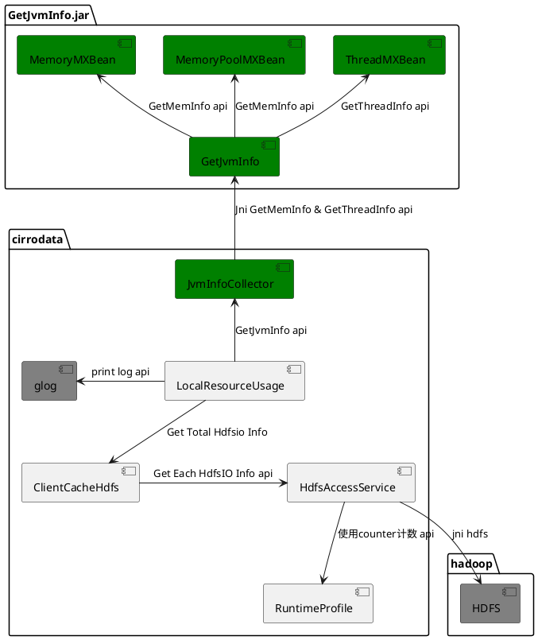

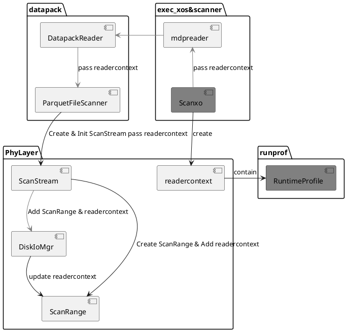

# 运行视图

## 新增hdfsio相关统计信息日志功能相关模块
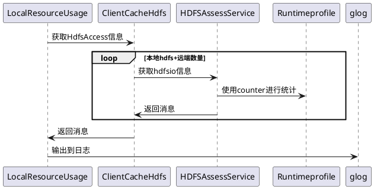
## 获取jvm内存与线程信息
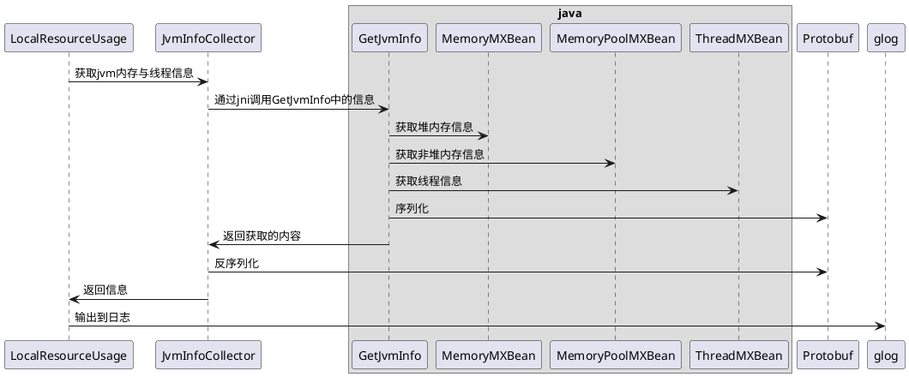

## 更新diskio相关的统计信息
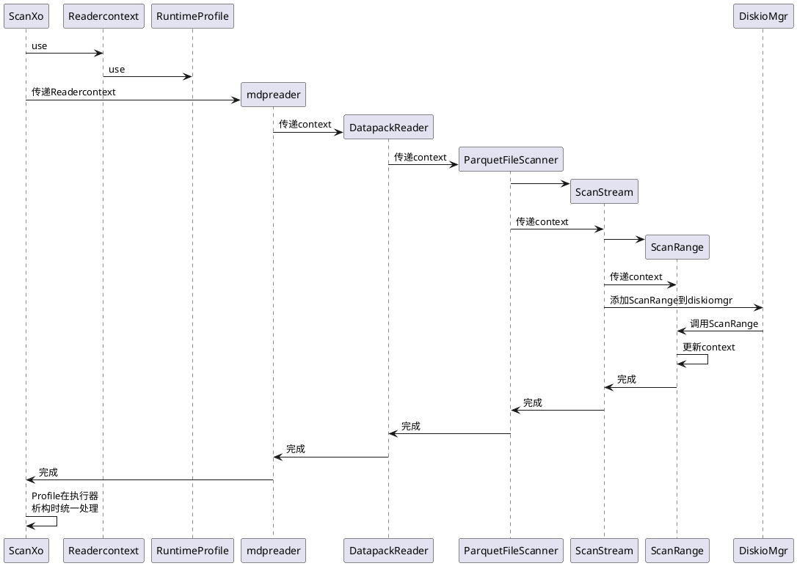

# Protobuf数据格式
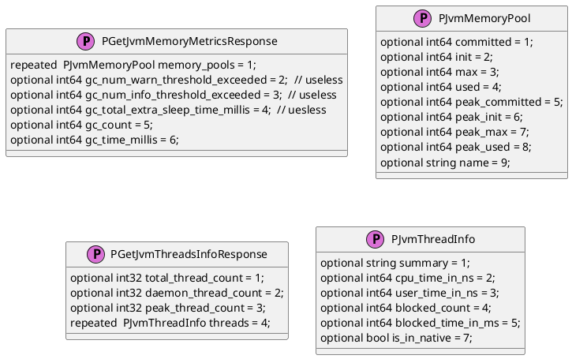
# Protobuf数据格式关系
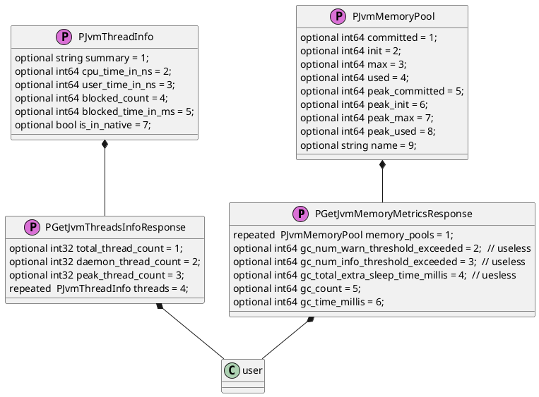
# ReaderContext数据

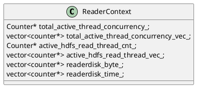

# 核心类子模块分解-HdfsAccessService子模块

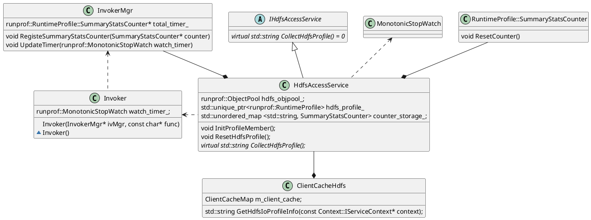
## 统计接口调用信息
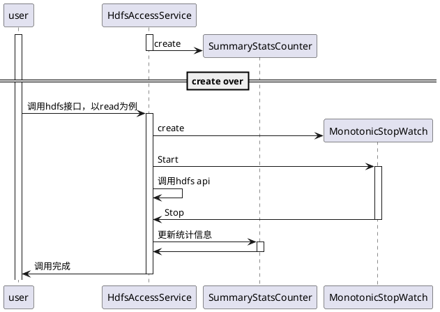

## 收集统计接口信息 
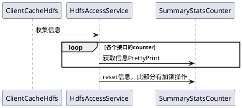

# 使用Invoker&InvokerMgr统计所有接口调用信息

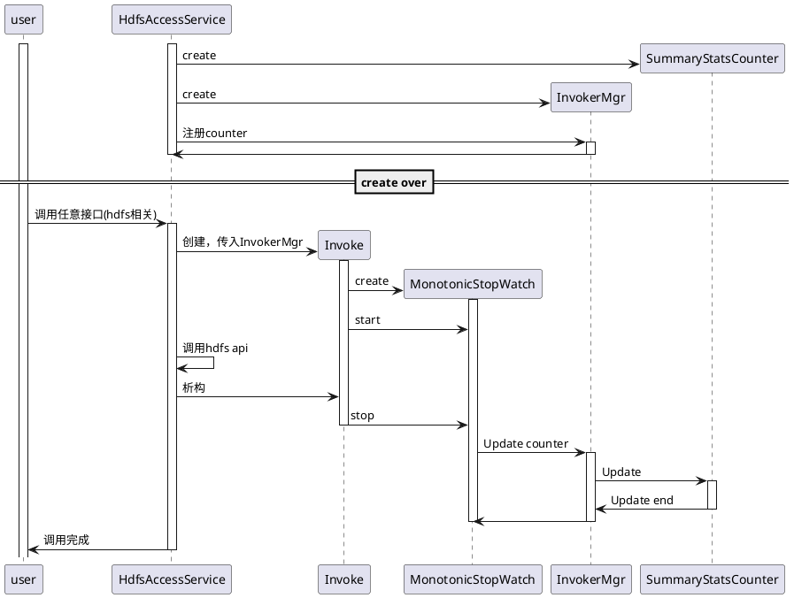
# 核心类子模块分解-并发线程使用度指标

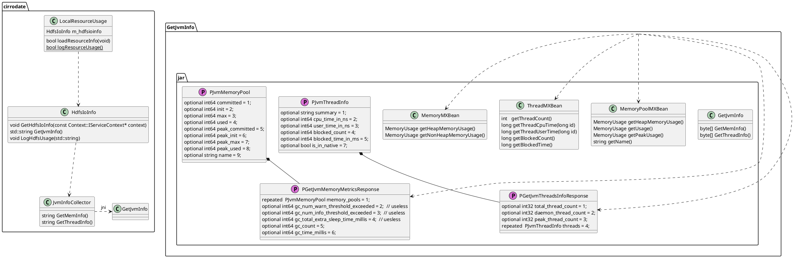

# 并发线程使用度指标
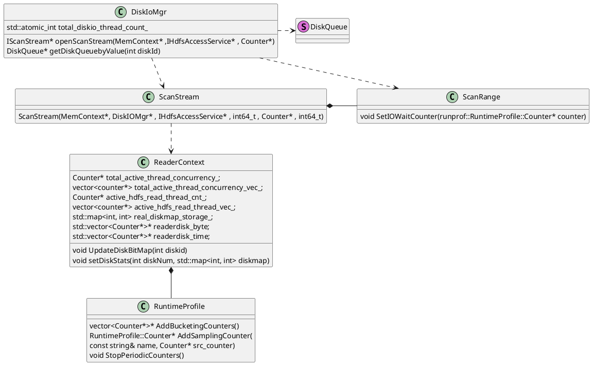

# DiskioMgr更新ReaderContext调用接口
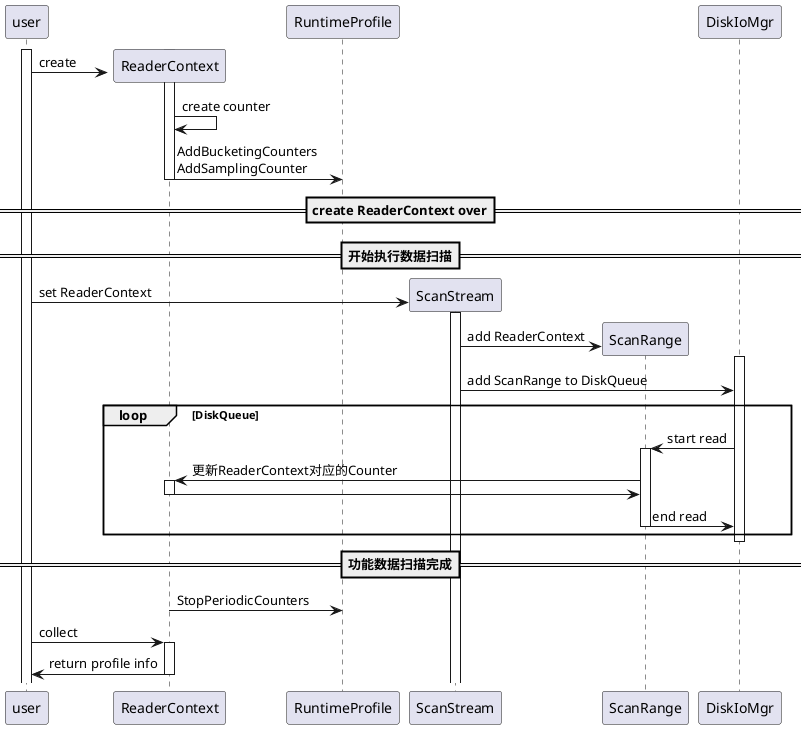

# 按disk显示吞吐量

