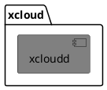
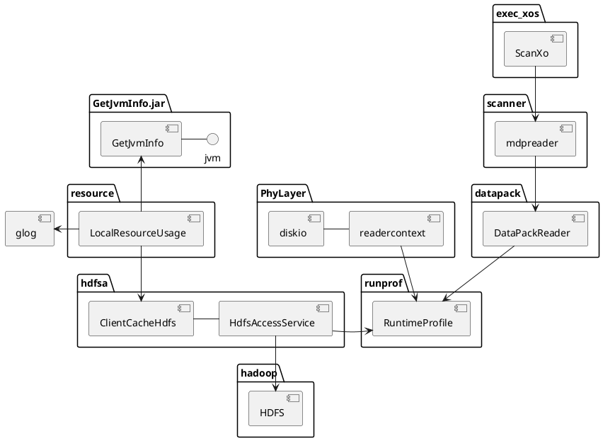
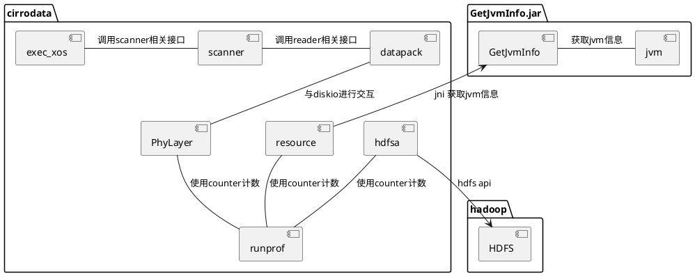
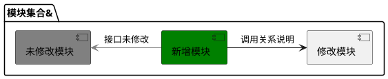
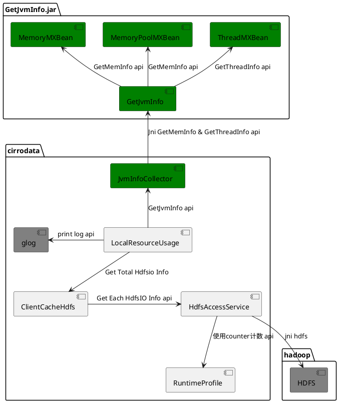
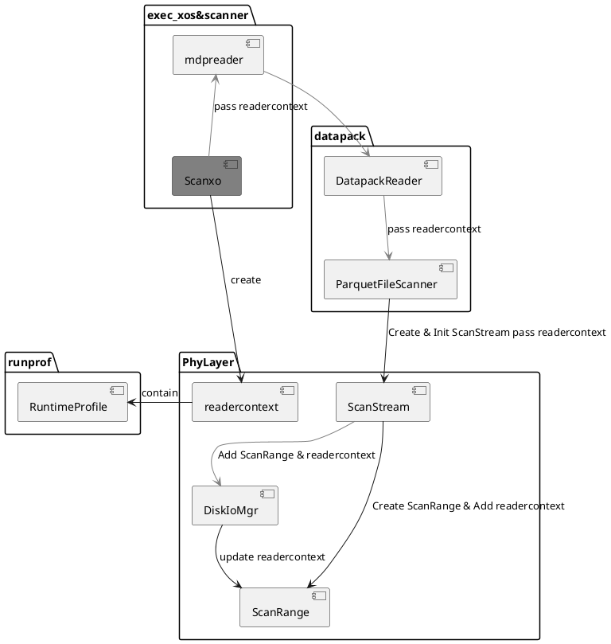
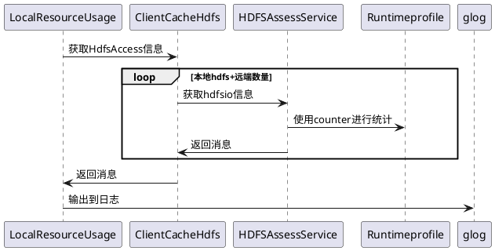
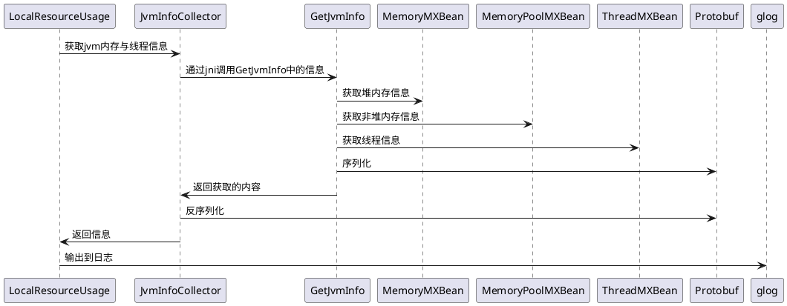

```plantuml
@startuml
package "xcloud" {
[xcloudd] #grey
}

@enduml
```

# 第零层分解1

```plantuml
@startuml
package "hdfsa" {
[ClientCacheHdfs] - [HdfsAccessService]
}
package "hadoop" {
[HDFS]
}
package "datapack" {
[DataPackReader]
}
package "runprof" {
[RuntimeProfile]
}
package "GetJvmInfo.jar" {
[GetJvmInfo] - jvm
}
package "exec_xos" {
[ScanXo]
}
package "PhyLayer" {
[diskio] - [readercontext]
}
package "scanner" {
[mdpreader]
}
[ScanXo] --> [mdpreader]
[mdpreader] --> [DataPackReader]
[DataPackReader] --> [RuntimeProfile]
[readercontext]  --> [RuntimeProfile]
[HdfsAccessService] --> [HDFS]

[HdfsAccessService] -right-> [RuntimeProfile]
package "resource" {
[LocalResourceUsage]
}
[LocalResourceUsage] --> [ClientCacheHdfs]
[LocalResourceUsage] -up-> [GetJvmInfo]
[LocalResourceUsage] -left-> [glog] 

@enduml

```

# 第零层分解2

```plantuml
@startuml
package "cirrodata" {
[hdfsa] -- [runprof] : 使用counter计数
[exec_xos] - [scanner] : 调用scanner相关接口
[scanner] - [datapack] : 调用reader相关接口
[datapack] -- [PhyLayer] : 与diskio进行交互
[resource] -down- [runprof] : 使用counter计数
[PhyLayer] -down- [runprof] : 使用counter计数
}

package "hadoop" {
[HDFS]
}
package "GetJvmInfo.jar" {
[GetJvmInfo] - [jvm] : 获取jvm信息
}
[hdfsa] --> [HDFS] : hdfs api
[resource] -up-> [GetJvmInfo] : jni 获取jvm信息
@enduml

```

# 图例

```plantuml
@startuml


package "模块集合&" {
[新增模块]  #green 
[修改模块] 
[未修改模块] #grey

[新增模块] -right-> [修改模块] : 调用关系说明
[新增模块] -left-> [未修改模块] #grey : 接口未修改 
}
@enduml

```
# 第一级分解

```plantuml
@startuml

package "cirrodata" {
[JvmInfoCollector] #green
[glog] #grey
[ClientCacheHdfs] -> [HdfsAccessService]: Get Each HdfsIO Info api
[RuntimeProfile]
[LocalResourceUsage] -up-> [JvmInfoCollector] : GetJvmInfo api 
[LocalResourceUsage] -left-> [glog] : print log api 
}
package "hadoop" {
[HDFS] #grey
}

package "GetJvmInfo.jar" {
[GetJvmInfo] #green
[MemoryMXBean] #green
[MemoryPoolMXBean] #green
[ThreadMXBean] #green
[GetJvmInfo] -up-> [MemoryMXBean] : GetMemInfo api
[GetJvmInfo] -up-> [MemoryPoolMXBean] : GetMemInfo api
[GetJvmInfo] -up-> [ThreadMXBean] : GetThreadInfo api
}


[HdfsAccessService] --> [HDFS] :jni hdfs 
[HdfsAccessService] --> [RuntimeProfile] : 使用counter计数 api
[LocalResourceUsage] --> [ClientCacheHdfs] : Get Total Hdfsio Info
[JvmInfoCollector] -up-> [GetJvmInfo] : Jni GetMemInfo & GetThreadInfo api


@enduml

```

```plantuml
@startuml

package "exec_xos&scanner" {
[Scanxo] #grey
[Scanxo] -up-> [mdpreader] #grey : pass readercontext
}

package "datapack" {
[DatapackReader] --> [ParquetFileScanner] #grey : pass readercontext

}
package "PhyLayer" {
[readercontext] 
[DiskIoMgr] --> [ScanRange] : update readercontext
[ScanRange]
[ScanStream]
}
package "runprof" {
[RuntimeProfile]
}

[mdpreader] --> [DatapackReader] #grey
[Scanxo] --> [readercontext] : create 

[ParquetFileScanner] --> [ScanStream] : Create & Init ScanStream pass readercontext
[ScanStream] --> [ScanRange] : Create ScanRange & Add readercontext

[ScanStream] --> [DiskIoMgr] #grey : Add ScanRange & readercontext

[readercontext] -left-> [RuntimeProfile] : contain

@enduml
```

# 运行视图

## 新增hdfsio相关统计信息日志功能相关模块

```plantuml
@startuml

LocalResourceUsage -> ClientCacheHdfs : 获取HdfsAccess信息
loop 本地hdfs+远端数量
    ClientCacheHdfs -> HDFSAssessService : 获取hdfsio信息
    HDFSAssessService -> Runtimeprofile : 使用counter进行统计
    HDFSAssessService -> ClientCacheHdfs : 返回消息
end
LocalResourceUsage <- ClientCacheHdfs : 返回消息
LocalResourceUsage -> glog : 输出到日志

@enduml
```
## 获取jvm内存与线程信息

```plantuml
@startuml
LocalResourceUsage -> JvmInfoCollector : 获取jvm内存与线程信息
JvmInfoCollector -> GetJvmInfo : 通过jni调用GetJvmInfo中的信息
GetJvmInfo -> MemoryMXBean : 获取堆内存信息
GetJvmInfo -> MemoryPoolMXBean : 获取非堆内存信息
GetJvmInfo -> ThreadMXBean : 获取线程信息

GetJvmInfo -> Protobuf : 序列化
GetJvmInfo -> JvmInfoCollector : 返回获取的内容
JvmInfoCollector -> Protobuf : 反序列化
JvmInfoCollector -> LocalResourceUsage : 返回信息
LocalResourceUsage -> glog : 输出到日志
@enduml
```