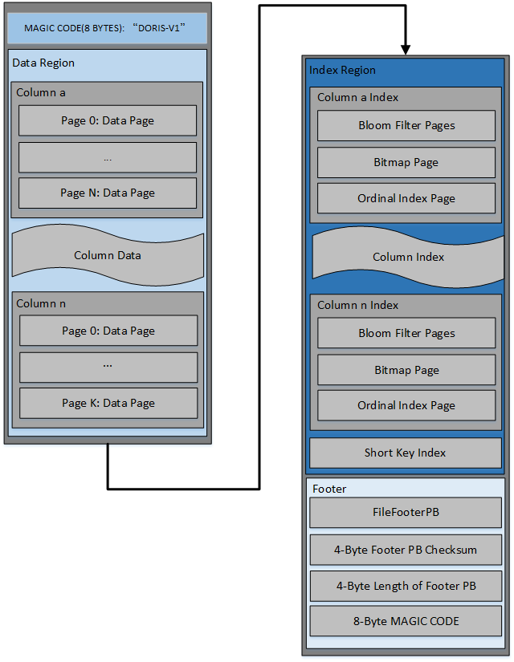
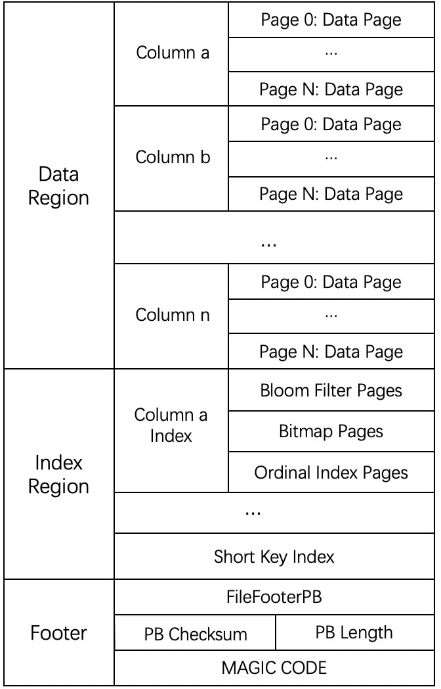
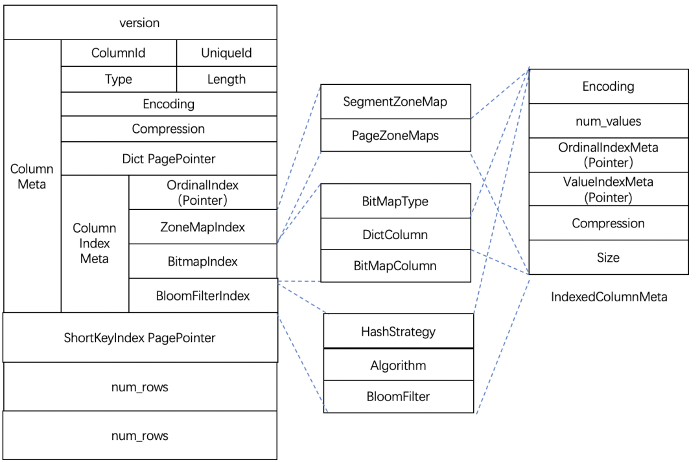
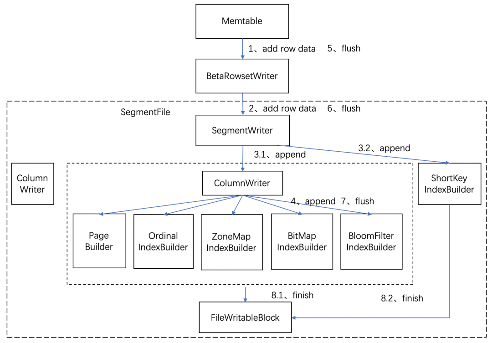
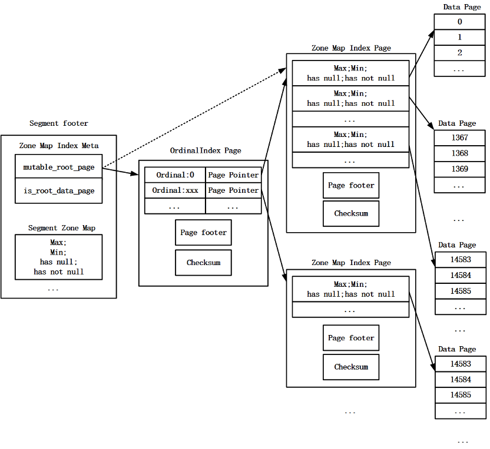
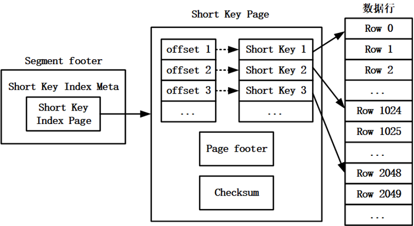
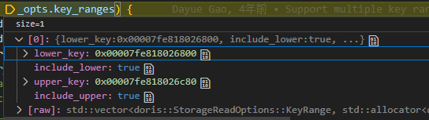

- [Doris Index介绍与分析](#doris-index介绍与分析)
  - [概述](#概述)
  - [segment储存格式与index的关系](#segment储存格式与index的关系)
  - [segment读写逻辑与index读写逻辑的关系简介](#segment读写逻辑与index读写逻辑的关系简介)
    - [index的写入流程](#index的写入流程)
    - [模块关系](#模块关系)
    - [index的读取流程](#index的读取流程)
    - [模块关系](#模块关系-1)
  - [索引介绍](#索引介绍)
    - [Ordinal 索引](#ordinal-索引)
      - [索引概述](#索引概述)
      - [索引生成](#索引生成)
      - [索引读取](#索引读取)
      - [索引使用](#索引使用)
    - [Zone Map 索引](#zone-map-索引)
      - [索引概述](#索引概述-1)
      - [索引生成](#索引生成-1)
      - [索引读取](#索引读取-1)
      - [索引使用](#索引使用-1)
    - [前缀索引（Short Key Index）](#前缀索引short-key-index)
      - [索引概述](#索引概述-2)
      - [索引生成](#索引生成-2)
      - [索引读取](#索引读取-2)
      - [索引使用](#索引使用-2)
    - [Bitmap 索引](#bitmap-索引)
    - [Bloom Filter 索引](#bloom-filter-索引)
  - [参考资料](#参考资料)


# Doris Index介绍与分析

## 概述
为了提高数据读取效率，Apache Doris 底层存储引擎提供了丰富的索引类型。分别是**前缀索引（Short Key Index）**、**Ordinal 索引**、**Zone Map索引**、**Bitmap 索引**、**Bloom Filter 索引与Ngram Bloomfilter索引**和**倒排索引（inverted index）**。
其中前缀索引、Ordinal 索引和 Zone Map 索引不需要用户干预，会随着数据写入自动生成，也有资料称这些索引为**内建的智能索引**
Bitmap 索引和 Bloom Filter 索引需要用户干预，数据写入时默认不会生成这两种索引，用户可以有选择地为指定的列添加这两种索引，可以称其为需要手动创建的**二级索引**


## segment储存格式与index的关系

doris的默认数存储单元为segment，Segment 文件可以有多个，一般按照大小进行分割，默认为 256MB。其中，Segment v2 文件命名规则为：\${rowset_id}_${segment_id}.dat
```
[lcz@nn1 segment]$ tree storage/data/10/31765/610265476 -h
storage/data/10/31765/610265476
├── [4.5M]  02000000000000099b47cf624aae3cacfc8a4d3680f849bb_0_31761.idx
├── [ 19M]  02000000000000099b47cf624aae3cacfc8a4d3680f849bb_0.dat
├── [4.5M]  02000000000000388d4bccd0cd2579e87b3e774d17d3de96_0_31761.idx
└── [ 19M]  02000000000000388d4bccd0cd2579e87b3e774d17d3de96_0.dat
```
其中两个.dat后缀的文件就是segment文件，idx后缀的文件为**倒排索引**生成的，.idx文件可以看做与segment不相干，因此可以对存量数据新增倒排索引，且不需要对已有的segment进行操作。

doris官方给出的segment的数据结构如下图所示：

整理一下可以按照下面的格式查看：


文件包括：
- 文件开始是8个字节的magic code，用于识别文件格式和版本
- Data Region：用于存储各个列的数据信息，这里的数据是按需分page加载的
- Index Region: doris中将各个列的index数据统一存储在Index Region，这里的数据会按照列粒度进行加载，所以跟列的数据信息分开存储
- Footer信息
	- FileFooterPB:定义文件的元数据信息
	- 4个字节的footer pb内容的checksum
	- 4个字节的FileFooterPB消息长度，用于读取FileFooterPB
	- 8个字节的MAGIC CODE，之所以在末位存储，是方便不同的场景进行文件类型的识别

**FileFooterPB结构**


为了防止索引本身数据量过大，ZoneMapIndex、BitMapIndex、BloomFilterIndex 采用了两级的 Page 管理。对应了 IndexColumnMeta 的结构，当一个 Page 能够放下时，当前 Page 直接存放索引数据，即采用 1 级结构；当一个 Page 无法放下时，索引数据写入新的 Page 中，Root Page 存储数据 Page 的地址信息。

## segment读写逻辑与index读写逻辑的关系简介

### index的写入流程


### 模块关系


SegmentWriter中包含_column_writers与_short_key_index_builder对象，short key index的写入逻辑实际在SegmentWriter中调用，其他的index写入逻辑是透过ColumnWriter调用的

### index的读取流程
<center>


</center>


### 模块关系

## 索引介绍
下面对各种具体类型的索引分别进行介绍
### Ordinal 索引
#### 索引概述
Apache Doris 底层采用列存的方式来存储数据，每一列数据会被分为多个Data Page。

数据刷写时，会为每一个Data Page生成一条Ordinal索引项，其中保存Data Page在Segment文件中的offset、Data Page的大小以及Data Page的起始行号，所有Data Page的Ordinal索引项会保存在一个Ordinal Index Page中， Ordinal Index Page在Segment文件中的offset以及Ordinal Index Page的大小会被保存在Segment文件的footer中，以便于数据读取时能够通过两级索引找到Data Page（首先，通过Segment文件的footer找到Ordinal Index Page，然后，通过Ordinal Index Page中的索引项找到Data Page）。


Ordinal Index Page的结构可以参考OrdinalIndexPB。

#### 索引生成


#### 索引读取


#### 索引使用
一般是通过使用行号来获取该行所在的page，并返回page point。从代码上看，Ordinal索引不仅仅用于datapage，其他的index页如果需要的话也会使用Ordinal索引进行记录（IndexedColumnWriter）。


### Zone Map 索引
#### 索引概述
Apache Doris 会为Segment文件中的一列数据添加Zone Map索引，同时会为列中的每一个Data Page添加Zone Map索引。Zone Map索引项中记录了每一列或列中每一个Data Page的最大值(max value)、最小值(min value)、是否有null值(has null)以及是否有非null值(has not null)的信息。初始化时，max value会被设置为当前列类型的最小值，min value会被设置为当前列类型的最大值，has null和has not null会被设置为false



#### 索引生成
数据写入阶段

数据flush 和 finish阶段，其中数据flush触发条件为page写满了或者主动finish


#### 索引读取


#### 索引使用
zone map 过滤原理简单概括就是使用sql中的过滤条件与zone map中的信息进行判断。
例如：过滤条件为 field = value。如果 value在Zone Map索引的最大值与最小值之间，则Data Page不能被过滤掉。
可以支持的过滤条件有 = 、< 、> 、<= 、>=、 is null、 is not null、 in

### 前缀索引（Short Key Index）
#### 索引概述
前缀索引是一种稀疏索引。数据刷写过程中，每写入一定的数据行（默认为 1024 行）就会生成一条前缀索引项。前缀索引会对每一个索引间隔的第一个数据行的前缀字段进行编码，前缀字段的编码与前缀字段的值具有相同的排序规则，即前缀字段的值排序越靠前，对应的编码值排序也越靠前。Segment 文件是按 Key 排序的，因此，前缀索引项也是按 Key 排序的。


**前缀索引长度规则**
将一行数据的前 36 个字节 作为这行数据的前缀索引。如果遇到VARCHAR，则进行截断，varchar最多保存20个字节。
根据实际测试, 用于生成short key 的column数量上限是3.

#### 索引生成


#### 索引读取

数据查询时，会打开Segment文件，从footer中获取Short Key Page的offset以及大小，然后从Segment文件中读取Short Key Page中的索引数据，并解析出每一条前缀索引项。

#### 索引使用
如果查询过滤条件包含前缀字段时，就可以使用前缀索引进行快速地行过滤。查询过滤条件会被划分成多个KeyRange。
例如user_id列为前缀索引列
```
select * from example_tbl where user_id>10000 and user_id<10002;
```
keyrange为(10000,10002)对一个keyrange

进行行过滤的方法如下：
- 寻找keyrange上界对应的upper_row_id

  - 对Key Range上界的前缀字段key进行编码。

  - 寻找key可能存在的范围下界start。根据编码寻找前缀索引中第一个等于（存在前缀索引项与key的编码相同）或大于（不存在前缀索引项的与key的编码相同）key编码的前缀索引项。如果找到满足条件的索引项，并且该索引项不是第一条前缀索引项，则将该索引项的前一条前缀索引项对应的行号记录为start（前缀索引是稀疏索引，第一个等于或大于Key Range上界key的数据行有可能在前一条前缀索引项对应的数据行之后）；如果找到满足条件的索引项，并且该索引项是第一条前缀索引项，则记录该索引项对应的行号为start。如果没有找到一条前缀索引项等于或大于key的编码，则记录最后一条前缀索引项对应的行号为start（第一个等于或大于key的行有可能在最后一条前缀索引项之后）。

  - 寻找key可能存在的范围上界end。根据编码寻找前缀索引中第一个大于key的二进制编码的索引项。如果找到满足条件的索引项，则记录该索引项对应的行号为end；如果没有找到一条前缀索引项大于key的编码，则记录Segment最后一行的行号为end。

  - 使用二分查找算法在start与end之间的行范围内寻找第一个大于key的编码的行，行号记为upper rowid。

- 根据二分法确定上界的行号，mid=(start+end)/2;根据mid找到mid所在的page，获取mid对应的值与上界值比较，直至找到上界值对应的upper_row_id;
- 下界值同样根据步骤获取lower_row_id，则根据前缀索引过滤出有效行数为lower_row_id~upper_row_id，为_row_bitmap

### Bitmap 索引
    TODO
### Bloom Filter 索引
    TODO
###　倒排索引（inverted index）
    TODO
## 参考资料
- [深度解析｜Apache Doris 索引机制解析](https://www.modb.pro/db/111345)
- [【Doris 全面解析】存储层设计介绍 1——存储结构设计解析](https://cirrodata.feishu.cn/docx/H7WOd6nD7ocDk0xUVU1cFQdDn5d)
- [Doris中的索引机制](https://cirrodata.feishu.cn/docx/IxS3dXy7Lo7kGrxkDNncq1Q9n4d)
- [doris-RowsetReader介绍](https://cirrodata.feishu.cn/file/Bx3QboWDpo6ynXxoRTucPWFwn6b)