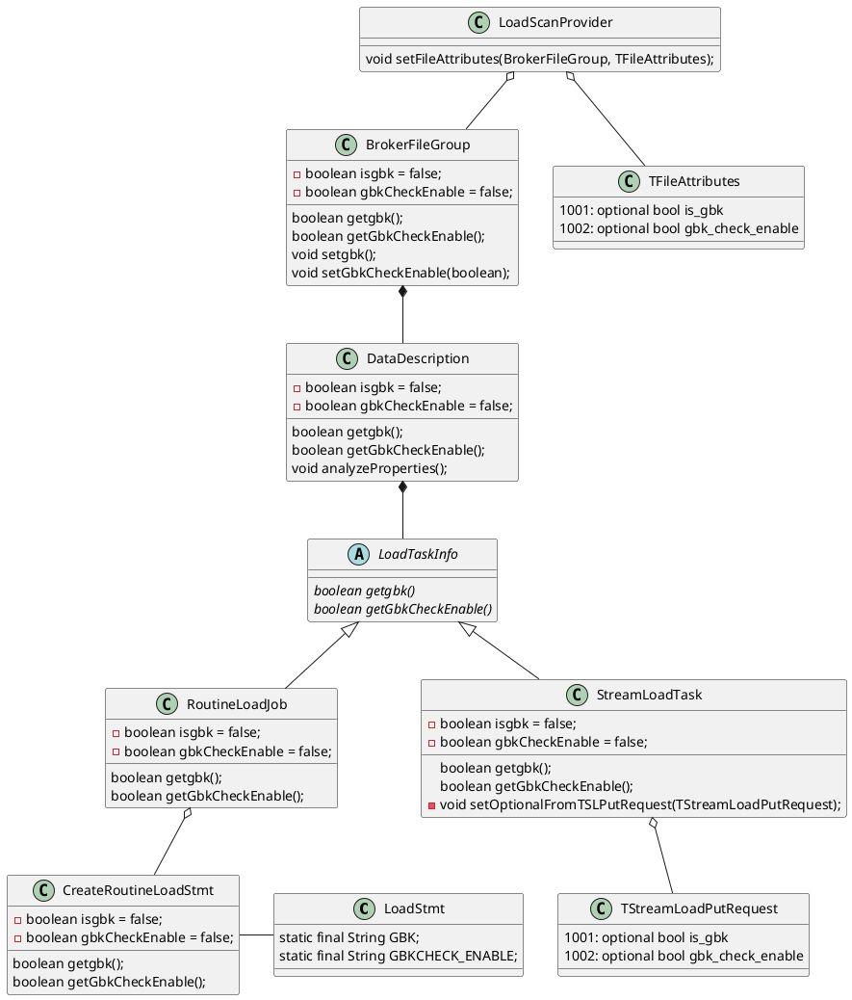
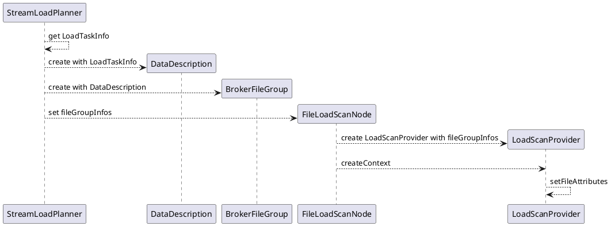
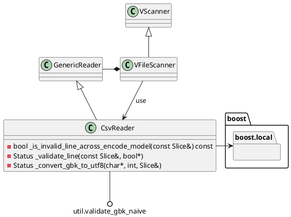
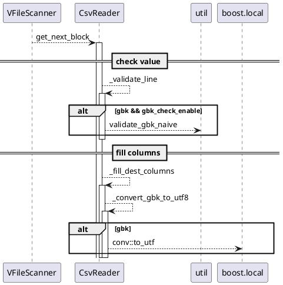

### FE模块关系

```plantuml
@startuml
class LoadStmt {
    static final String GBK;
    static final String GBKCHECK_ENABLE;
}
class CreateRoutineLoadStmt {
    -boolean isgbk = false;
    -boolean gbkCheckEnable = false;
    boolean getgbk();
    boolean getGbkCheckEnable();
}
class DataDescription {
    -boolean isgbk = false;
    -boolean gbkCheckEnable = false;
    boolean getgbk();
    boolean getGbkCheckEnable();
    void analyzeProperties();
}

class BrokerFileGroup {
    -boolean isgbk = false;
    -boolean gbkCheckEnable = false;
    boolean getgbk();
    boolean getGbkCheckEnable();
    void setgbk();
    void setGbkCheckEnable(boolean);
}
class TFileAttributes {
    1001: optional bool is_gbk
    1002: optional bool gbk_check_enable
}
class TStreamLoadPutRequest {
    1001: optional bool is_gbk
    1002: optional bool gbk_check_enable
}
class LoadScanProvider {
    void setFileAttributes(BrokerFileGroup, TFileAttributes);
}
abstract class LoadTaskInfo {
    {abstract} boolean getgbk()
    {abstract} boolean getGbkCheckEnable()
}
class RoutineLoadJob {
    -boolean isgbk = false;
    -boolean gbkCheckEnable = false;
    boolean getgbk();
    boolean getGbkCheckEnable();
}
class StreamLoadTask {
    -boolean isgbk = false;
    -boolean gbkCheckEnable = false;
    boolean getgbk();
    boolean getGbkCheckEnable();
    -void setOptionalFromTSLPutRequest(TStreamLoadPutRequest);
}

LoadTaskInfo <|-- RoutineLoadJob
LoadTaskInfo <|-- StreamLoadTask
LoadScanProvider o-- TFileAttributes
LoadScanProvider o-- BrokerFileGroup
BrokerFileGroup *-- DataDescription
DataDescription *-- LoadTaskInfo
RoutineLoadJob o-- CreateRoutineLoadStmt
CreateRoutineLoadStmt - LoadStmt
StreamLoadTask o-- TStreamLoadPutRequest
@enduml
```
### 运行视图

```plantuml
@startuml
StreamLoadPlanner --> StreamLoadPlanner : get LoadTaskInfo
create DataDescription
StreamLoadPlanner --> DataDescription : create with LoadTaskInfo
create BrokerFileGroup
StreamLoadPlanner --> BrokerFileGroup : create with DataDescription
create FileLoadScanNode
StreamLoadPlanner --> FileLoadScanNode : set fileGroupInfos
create LoadScanProvider
FileLoadScanNode --> LoadScanProvider : create LoadScanProvider with fileGroupInfos
FileLoadScanNode --> LoadScanProvider : createContext
LoadScanProvider --> LoadScanProvider : setFileAttributes
@enduml
```

### BE模块关系

```plantuml
@startuml
class VScanner {}
class VFileScanner{}
class CsvReader {
    - bool _is_invalid_line_across_encode_model(const Slice&) const
    - Status _validate_line(const Slice&, bool*)
    - Status _convert_gbk_to_utf8(char*, int, Slice&)
}
namespace boost.local{}

VScanner <|-- VFileScanner
VFileScanner *-left- GenericReader
VFileScanner --> CsvReader : use
CsvReader -left-> boost.local
GenericReader <|-- CsvReader
CsvReader --() util.validate_gbk_naive
@enduml
```

### 运行视图

```plantuml
@startuml
VFileScanner --> CsvReader : get_next_block
== check value ==
activate CsvReader
    CsvReader --> CsvReader : _validate_line
    activate CsvReader
        alt gbk && gbk_check_enable
            CsvReader --> util : validate_gbk_naive
        end
    deactivate CsvReader
== fill columns ==
CsvReader --> CsvReader : _fill_dest_columns
    activate CsvReader
        CsvReader --> CsvReader : _convert_gbk_to_utf8
            activate CsvReader
                alt gbk
                    CsvReader --> boost.local : conv::to_utf
                end
            deactivate CsvReader
    deactivate CsvReader
@enduml
```