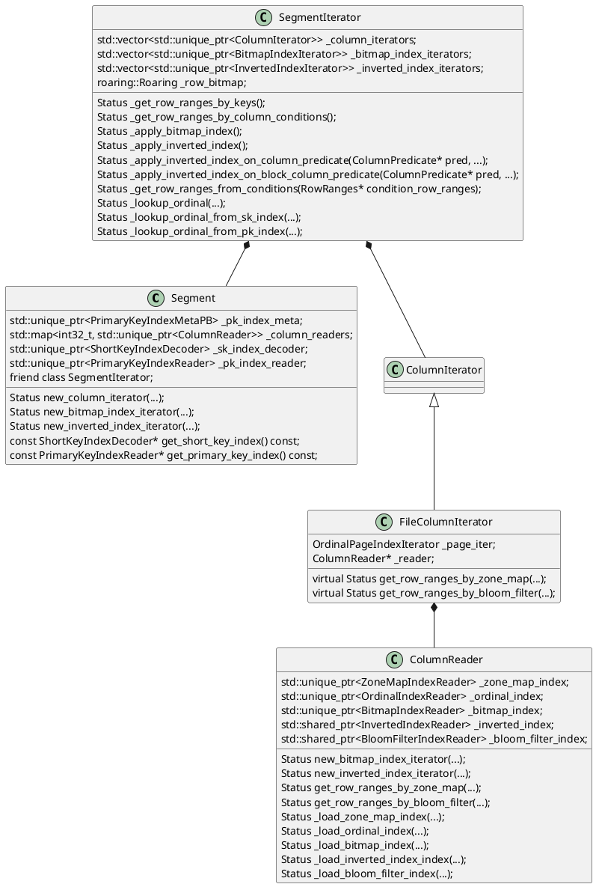
```plantuml
@startuml
class Segment {
    std::unique_ptr<PrimaryKeyIndexMetaPB> _pk_index_meta;
    std::map<int32_t, std::unique_ptr<ColumnReader>> _column_readers;
    std::unique_ptr<ShortKeyIndexDecoder> _sk_index_decoder;
    std::unique_ptr<PrimaryKeyIndexReader> _pk_index_reader;
    friend class SegmentIterator;
    Status new_column_iterator(...);
    Status new_bitmap_index_iterator(...);
    Status new_inverted_index_iterator(...);
    const ShortKeyIndexDecoder* get_short_key_index() const;
    const PrimaryKeyIndexReader* get_primary_key_index() const;
}
class SegmentIterator {
    Status _get_row_ranges_by_keys();
    Status _get_row_ranges_by_column_conditions();
    Status _apply_bitmap_index();
    Status _apply_inverted_index();
    Status _apply_inverted_index_on_column_predicate(ColumnPredicate* pred, ...);
    Status _apply_inverted_index_on_block_column_predicate(ColumnPredicate* pred, ...);
    Status _get_row_ranges_from_conditions(RowRanges* condition_row_ranges);
    Status _lookup_ordinal(...);
    Status _lookup_ordinal_from_sk_index(...);
    Status _lookup_ordinal_from_pk_index(...);
    std::vector<std::unique_ptr<ColumnIterator>> _column_iterators;
    std::vector<std::unique_ptr<BitmapIndexIterator>> _bitmap_index_iterators;
    std::vector<std::unique_ptr<InvertedIndexIterator>> _inverted_index_iterators;
    roaring::Roaring _row_bitmap;
}
class ColumnIterator {
}
class FileColumnIterator {
    virtual Status get_row_ranges_by_zone_map(...);
    virtual Status get_row_ranges_by_bloom_filter(...);
    OrdinalPageIndexIterator _page_iter;
    ColumnReader* _reader;
}
class ColumnReader {
    Status new_bitmap_index_iterator(...);
    Status new_inverted_index_iterator(...);
    Status get_row_ranges_by_zone_map(...);
    Status get_row_ranges_by_bloom_filter(...);
    Status _load_zone_map_index(...);
    Status _load_ordinal_index(...);
    Status _load_bitmap_index(...);
    Status _load_inverted_index_index(...);
    Status _load_bloom_filter_index(...);
    std::unique_ptr<ZoneMapIndexReader> _zone_map_index;
    std::unique_ptr<OrdinalIndexReader> _ordinal_index;
    std::unique_ptr<BitmapIndexReader> _bitmap_index;
    std::shared_ptr<InvertedIndexReader> _inverted_index;
    std::shared_ptr<BloomFilterIndexReader> _bloom_filter_index;
}
SegmentIterator *-- Segment
ColumnIterator <|-- FileColumnIterator
FileColumnIterator *-- ColumnReader
SegmentIterator *-- ColumnIterator
@enduml
```
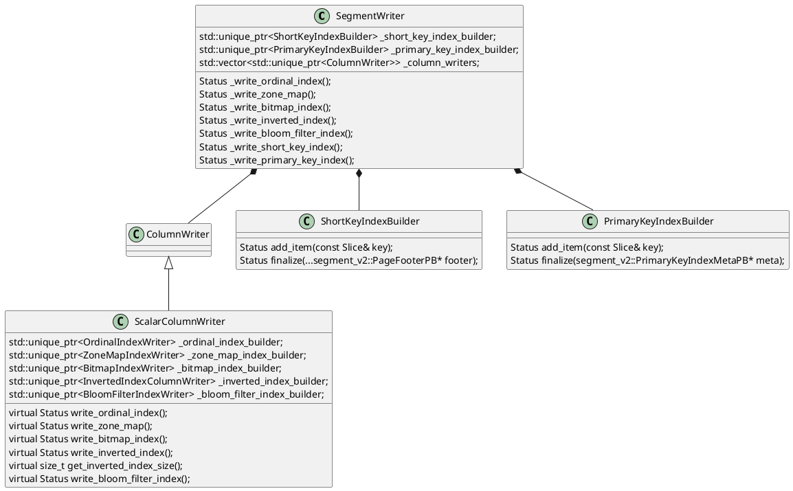
```plantuml
@startuml
class SegmentWriter {
    Status _write_ordinal_index();
    Status _write_zone_map();
    Status _write_bitmap_index();
    Status _write_inverted_index();
    Status _write_bloom_filter_index();
    Status _write_short_key_index();
    Status _write_primary_key_index();
    std::unique_ptr<ShortKeyIndexBuilder> _short_key_index_builder;
    std::unique_ptr<PrimaryKeyIndexBuilder> _primary_key_index_builder;
    std::vector<std::unique_ptr<ColumnWriter>> _column_writers;
}
class ColumnWriter {

}
class ScalarColumnWriter {
    virtual Status write_ordinal_index();
    virtual Status write_zone_map();
    virtual Status write_bitmap_index();
    virtual Status write_inverted_index();
    virtual size_t get_inverted_index_size();
    virtual Status write_bloom_filter_index();
    std::unique_ptr<OrdinalIndexWriter> _ordinal_index_builder;
    std::unique_ptr<ZoneMapIndexWriter> _zone_map_index_builder;
    std::unique_ptr<BitmapIndexWriter> _bitmap_index_builder;
    std::unique_ptr<InvertedIndexColumnWriter> _inverted_index_builder;
    std::unique_ptr<BloomFilterIndexWriter> _bloom_filter_index_builder;
}

class ShortKeyIndexBuilder {
    Status add_item(const Slice& key);
    Status finalize(...segment_v2::PageFooterPB* footer);
}
class PrimaryKeyIndexBuilder {
    Status add_item(const Slice& key);
    Status finalize(segment_v2::PrimaryKeyIndexMetaPB* meta);
}
ColumnWriter <|-- ScalarColumnWriter
SegmentWriter *-- ColumnWriter
SegmentWriter *-- ShortKeyIndexBuilder
SegmentWriter *-- PrimaryKeyIndexBuilder
@enduml
```
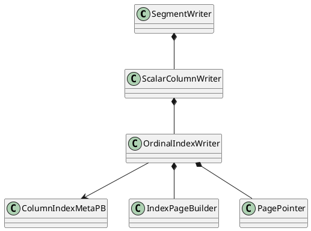
```plantuml
@startuml
class SegmentWriter {}
class ScalarColumnWriter {}
class OrdinalIndexWriter {}
class ColumnIndexMetaPB {}
class IndexPageBuilder {}
class PagePointer {}
SegmentWriter *-- ScalarColumnWriter
ScalarColumnWriter *-- OrdinalIndexWriter
OrdinalIndexWriter *-- IndexPageBuilder
OrdinalIndexWriter *-- PagePointer
OrdinalIndexWriter --> ColumnIndexMetaPB
@enduml
```
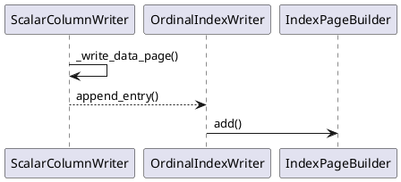
```plantuml
@startuml
ScalarColumnWriter -> ScalarColumnWriter: _write_data_page()
ScalarColumnWriter --> OrdinalIndexWriter: append_entry()
OrdinalIndexWriter -> IndexPageBuilder: add()
@enduml
```
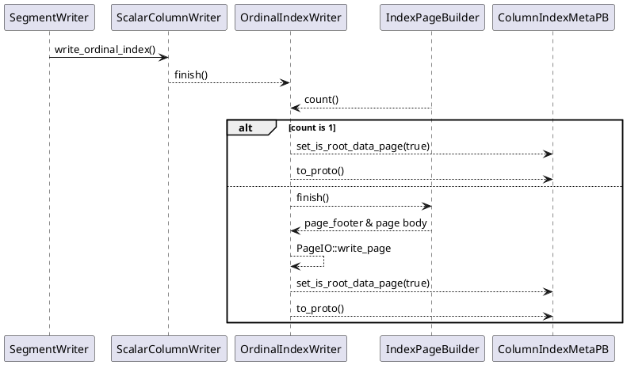
```plantuml
@startuml
SegmentWriter -> ScalarColumnWriter: write_ordinal_index()
ScalarColumnWriter --> OrdinalIndexWriter: finish()
OrdinalIndexWriter <-- IndexPageBuilder : count()
alt count is 1
    OrdinalIndexWriter --> ColumnIndexMetaPB : set_is_root_data_page(true)
    OrdinalIndexWriter --> ColumnIndexMetaPB : to_proto()
else
    OrdinalIndexWriter --> IndexPageBuilder: finish()
    OrdinalIndexWriter <-- IndexPageBuilder: page_footer & page body
    OrdinalIndexWriter --> OrdinalIndexWriter : PageIO::write_page
    OrdinalIndexWriter --> ColumnIndexMetaPB : set_is_root_data_page(true)
    OrdinalIndexWriter --> ColumnIndexMetaPB : to_proto()
end
@enduml
```
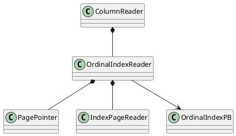
```plantuml

@startuml
class ColumnReader {}
class OrdinalIndexReader {}
class PagePointer{}
class IndexPageReader{}
class OrdinalIndexPB{}

ColumnReader *-- OrdinalIndexReader
OrdinalIndexReader *-- PagePointer
OrdinalIndexReader *-- IndexPageReader
OrdinalIndexReader --> OrdinalIndexPB
@enduml
```
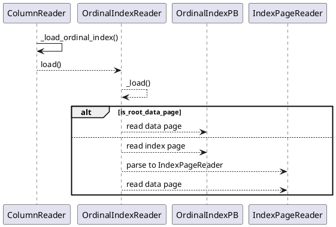
```plantuml
@startuml
ColumnReader -> ColumnReader: _load_ordinal_index()
ColumnReader --> OrdinalIndexReader: load()
OrdinalIndexReader --> OrdinalIndexReader : _load()
alt is_root_data_page
    OrdinalIndexReader --> OrdinalIndexPB: read data page
else
    OrdinalIndexReader --> OrdinalIndexPB: read index page
    OrdinalIndexReader --> IndexPageReader: parse to IndexPageReader
    OrdinalIndexReader --> IndexPageReader: read data page
end
@enduml
```
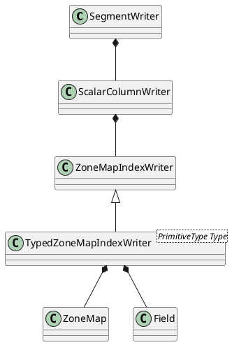
```plantuml
@startuml
class SegmentWriter {}
class ScalarColumnWriter {}
class ZoneMapIndexWriter {}
class TypedZoneMapIndexWriter<PrimitiveType Type> {}
class ZoneMap {}
class Field {}
SegmentWriter *-- ScalarColumnWriter
ScalarColumnWriter *-- ZoneMapIndexWriter
ZoneMapIndexWriter <|-- TypedZoneMapIndexWriter
TypedZoneMapIndexWriter *-- ZoneMap
TypedZoneMapIndexWriter *-- Field
@enduml
```
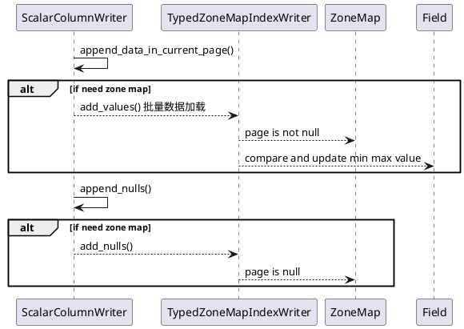
```plantuml
@startuml
ScalarColumnWriter -> ScalarColumnWriter: append_data_in_current_page()
alt if need zone map
    ScalarColumnWriter --> TypedZoneMapIndexWriter: add_values() 批量数据加载
    TypedZoneMapIndexWriter --> ZoneMap : page is not null
    TypedZoneMapIndexWriter --> Field : compare and update min max value
end

ScalarColumnWriter -> ScalarColumnWriter: append_nulls()
alt if need zone map
    ScalarColumnWriter --> TypedZoneMapIndexWriter: add_nulls()
    TypedZoneMapIndexWriter --> ZoneMap : page is null
end
@enduml
```
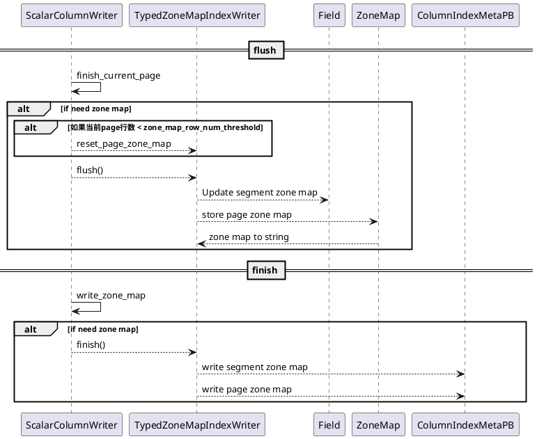
```plantuml
@startuml
== flush ==
ScalarColumnWriter -> ScalarColumnWriter: finish_current_page
alt if need zone map
    alt 如果当前page行数 < zone_map_row_num_threshold
        ScalarColumnWriter --> TypedZoneMapIndexWriter: reset_page_zone_map
    end
    ScalarColumnWriter --> TypedZoneMapIndexWriter :flush()
    TypedZoneMapIndexWriter -->  Field : Update segment zone map
    TypedZoneMapIndexWriter --> ZoneMap : store page zone map
    TypedZoneMapIndexWriter <-- ZoneMap : zone map to string
end

== finish ==
ScalarColumnWriter -> ScalarColumnWriter: write_zone_map
alt if need zone map
    ScalarColumnWriter --> TypedZoneMapIndexWriter :finish()
    TypedZoneMapIndexWriter --> ColumnIndexMetaPB : write segment zone map
    TypedZoneMapIndexWriter --> ColumnIndexMetaPB : write page zone map
end
@enduml
```
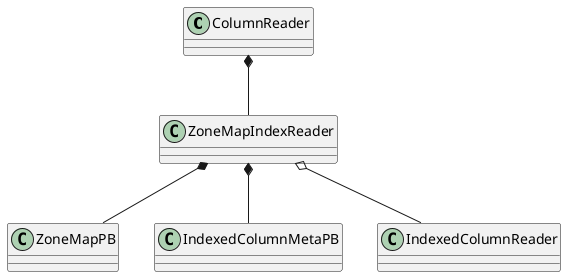
```plantuml

@startuml
class ColumnReader {}
class ZoneMapIndexReader {}
class ZoneMapPB{}
class IndexedColumnMetaPB{}

ColumnReader *-- ZoneMapIndexReader
ZoneMapIndexReader *-- ZoneMapPB
ZoneMapIndexReader *-- IndexedColumnMetaPB
ZoneMapIndexReader o-- IndexedColumnReader
@enduml
```
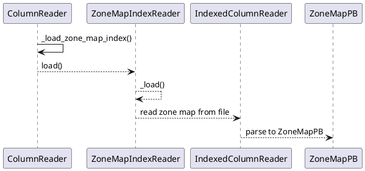
```plantuml
@startuml
ColumnReader -> ColumnReader: _load_zone_map_index()
ColumnReader --> ZoneMapIndexReader: load()
ZoneMapIndexReader --> ZoneMapIndexReader : _load()
ZoneMapIndexReader --> IndexedColumnReader: read zone map from file
IndexedColumnReader --> ZoneMapPB: parse to ZoneMapPB
@enduml
```
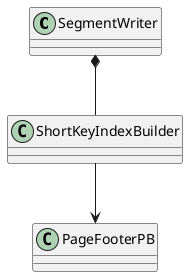
```plantuml
@startuml
class SegmentWriter {}
class ShortKeyIndexBuilder {}
class PageFooterPB {}
SegmentWriter *-- ShortKeyIndexBuilder
ShortKeyIndexBuilder --> PageFooterPB
@enduml
```
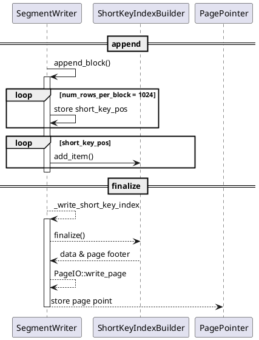
```plantuml
@startuml
== append ==
SegmentWriter -> SegmentWriter: append_block()
activate SegmentWriter
loop num_rows_per_block = 1024
    SegmentWriter -> SegmentWriter : store short_key_pos
end

loop short_key_pos
    SegmentWriter -> ShortKeyIndexBuilder : add_item()
end
deactivate SegmentWriter

== finalize ==
SegmentWriter --> SegmentWriter: _write_short_key_index
activate SegmentWriter
SegmentWriter --> ShortKeyIndexBuilder: finalize()
SegmentWriter <-- ShortKeyIndexBuilder: data & page footer
SegmentWriter --> SegmentWriter : PageIO::write_page
SegmentWriter --> PagePointer : store page point
deactivate SegmentWriter
@enduml

```