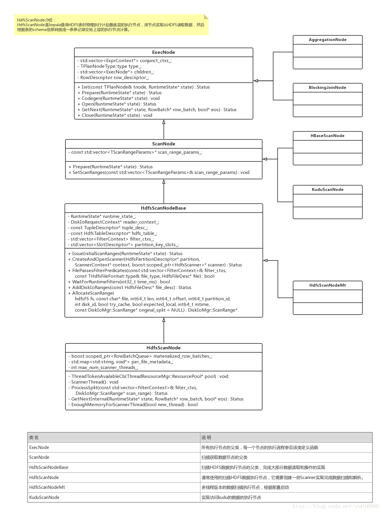
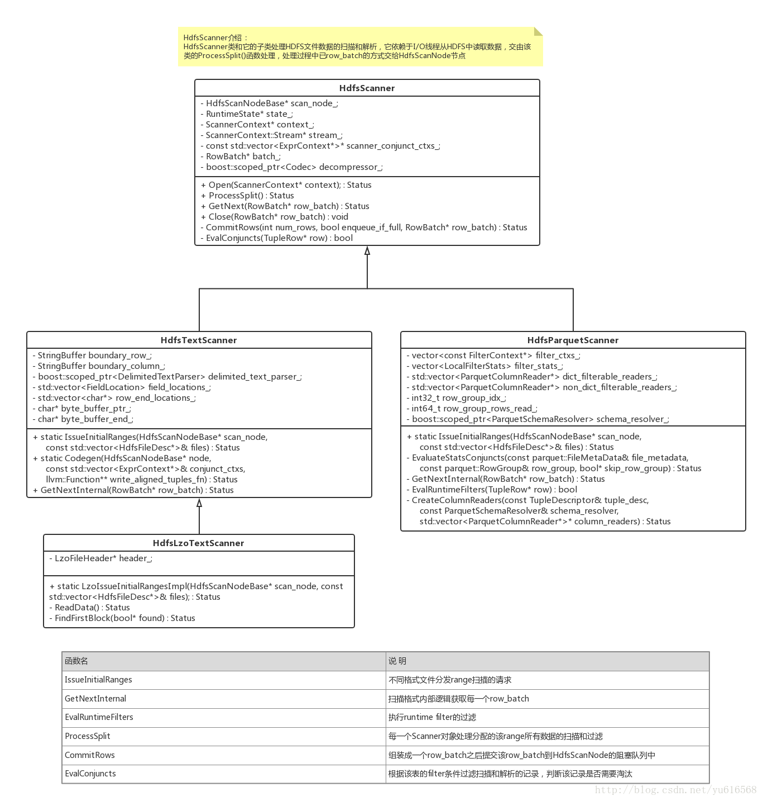
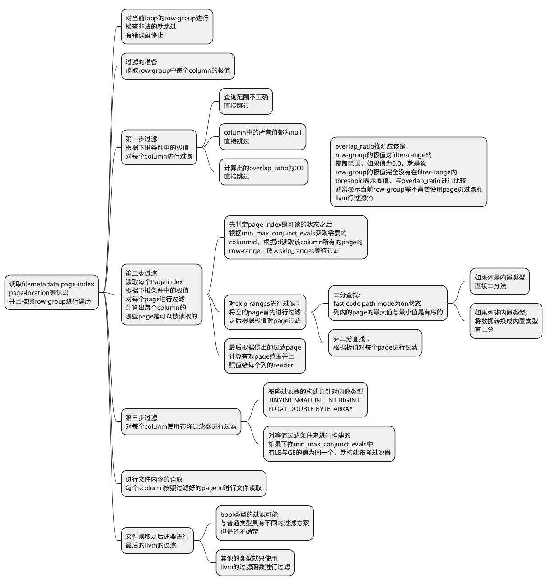
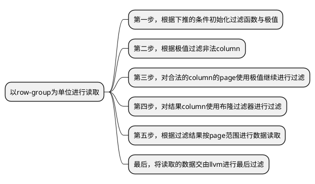
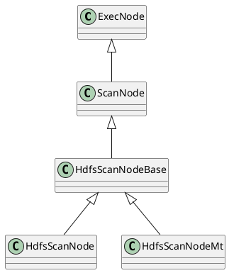
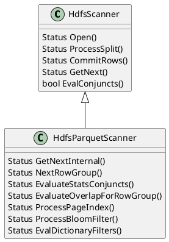
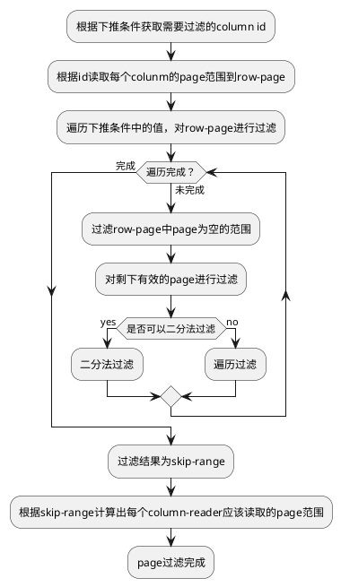

# **本文记录impala的查询方案的调研结果**

## **调研范围**
调研impala根据where过滤条件在scanner工作期间对page或者row-group的过滤方法。此外where的过滤条件的优化或者columnscanner的优化不在此次讨论的范围之内。

## **scanner的启动情况**
见博客图示

## **parquet-scanner的行为**
见博客图示

## **parquet-scanner对page的过滤操作**

