# **本文记录在构思dp文件pageindex过滤功能的一些图示**

## 需求列表

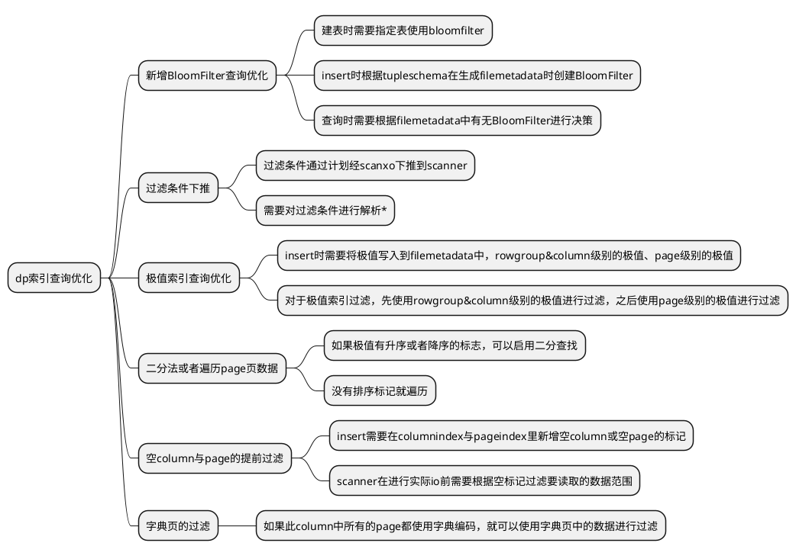

## Scanner部分的运行流程

### open&addrange流程
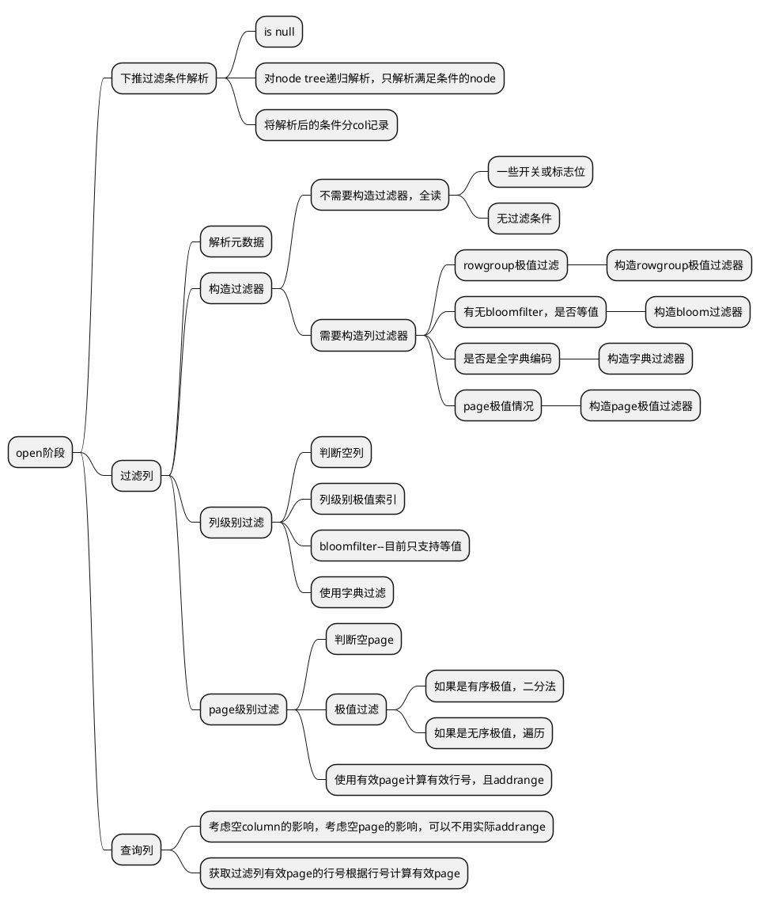
### read流程
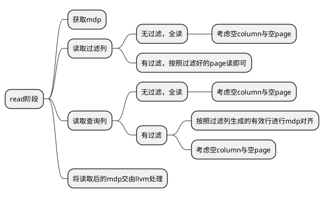

## parquet文件中需要添加的元素
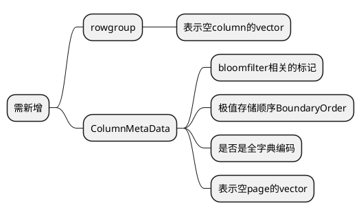

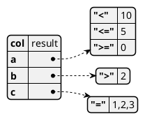

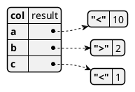

## 一级模块关系图
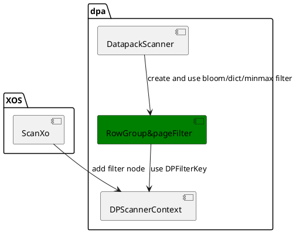

# 运行视图

## 条件下推
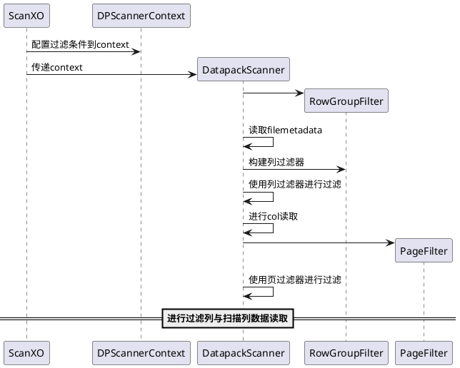
## 新增存储结构

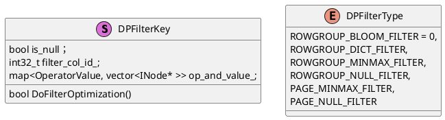

## 新增的RowGroupFilter模块

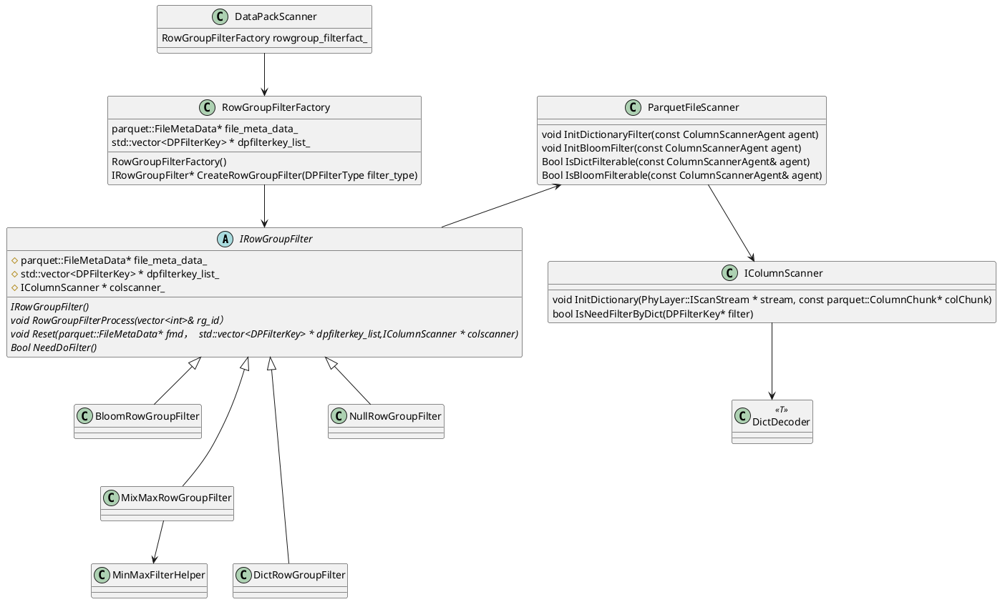

## 运行视图

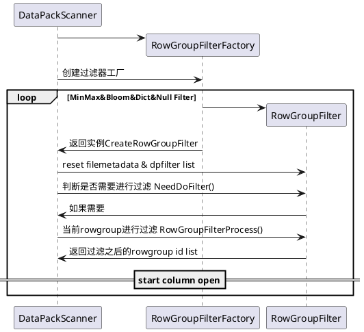

## 运行视图

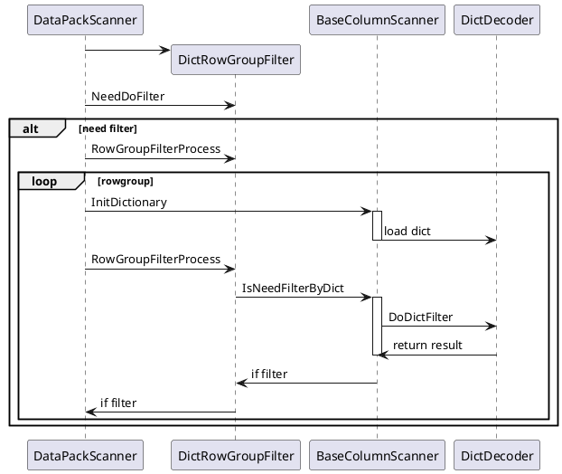

## 运行视图

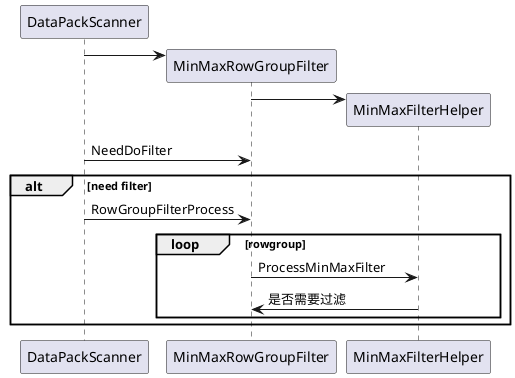
## 运行视图

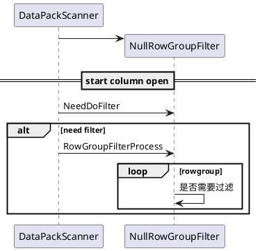

## 新增的PageFilter模块

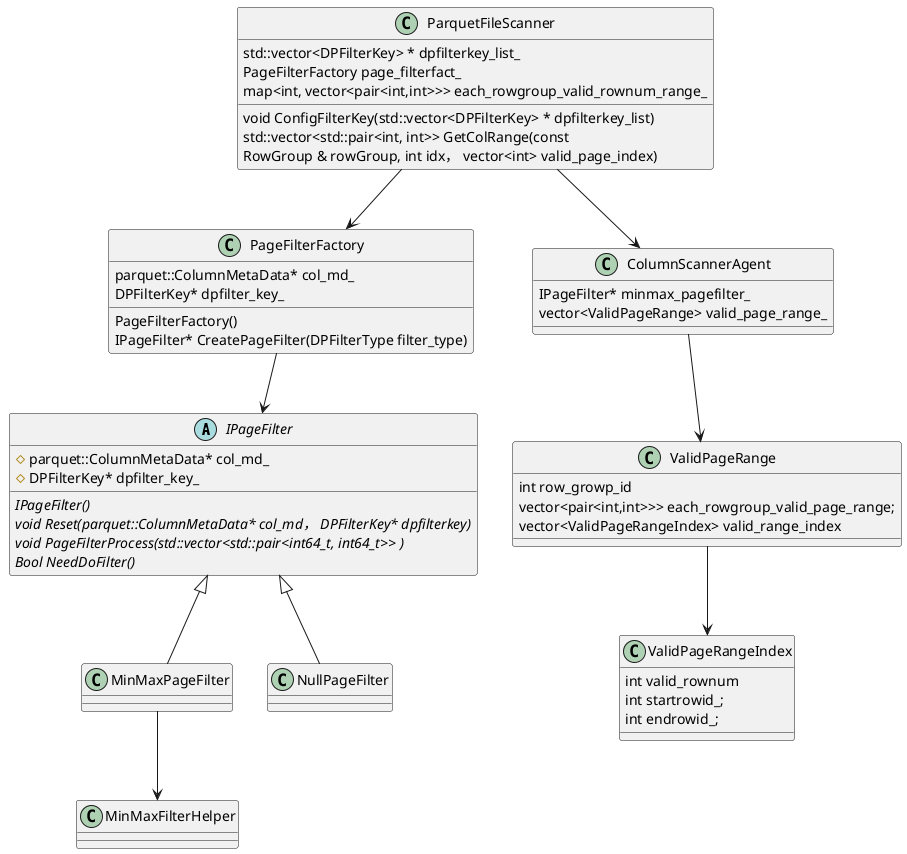

## 运行视图

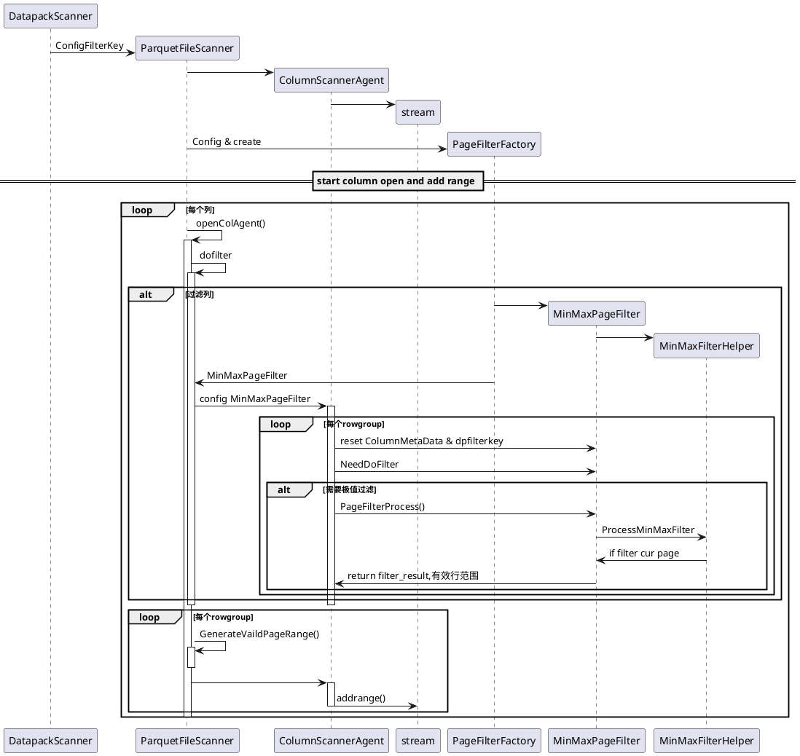

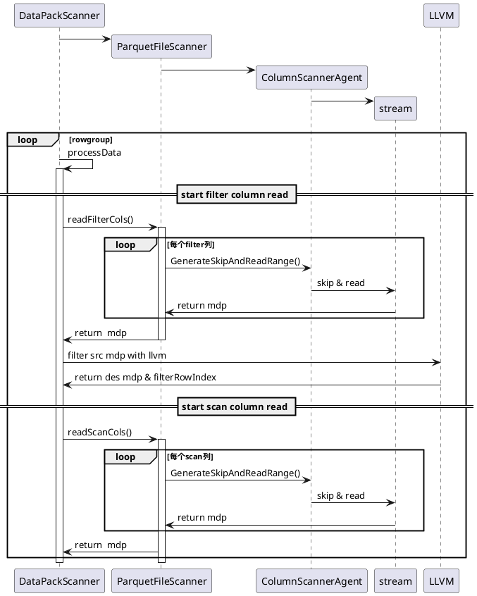

# 详设相关

## 公共数据类型
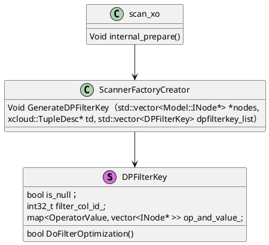

## minmaxfilterhelper
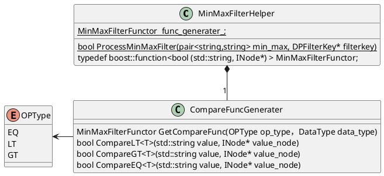

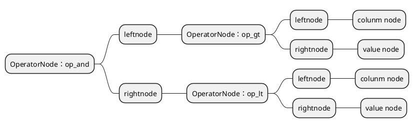

