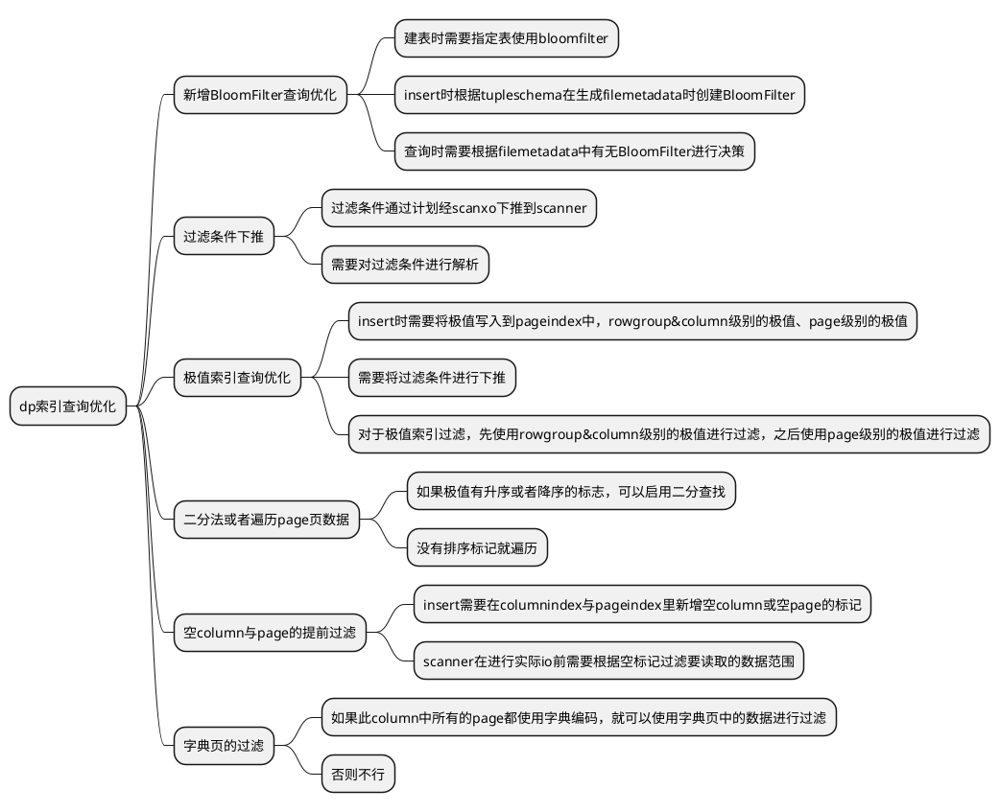
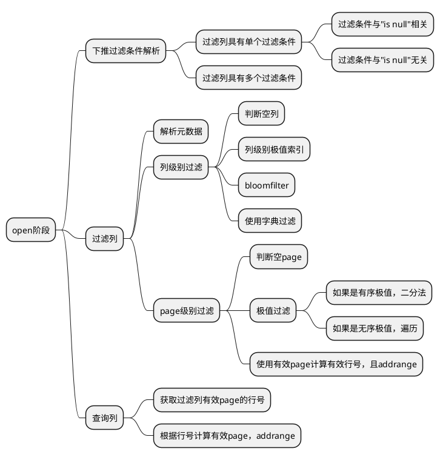
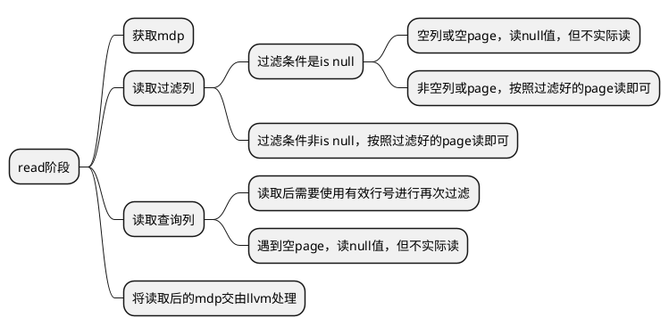
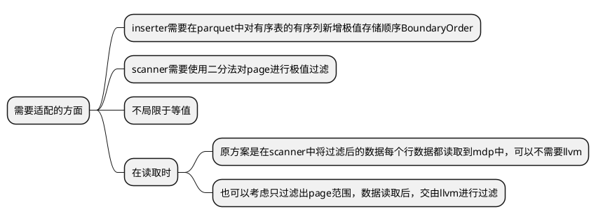
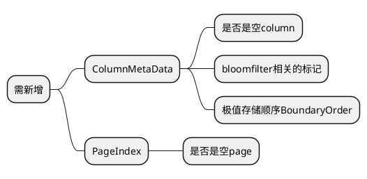

<!--
 * @Author: lcz lcz@git.com
 * @Date: 2022-06-28 14:12:06
 * @LastEditors: lcz lcz@git.com
 * @LastEditTime: 2022-07-01 16:42:18
 * @FilePath: /github/harpseal/东方国信工作资料/点查询/pageindex过滤相关功能.md
 * @Description: 这是默认设置,请设置`customMade`, 打开koroFileHeader查看配置 进行设置: https://github.com/OBKoro1/koro1FileHeader/wiki/%E9%85%8D%E7%BD%AE
-->
# **本文记录在构思dp文件pageindex过滤功能的一些图示**

## 需求列表

## Scanner部分的运行流程

### open&addrange流程

### read流程

### 对于现有的有序表点查询优化逻辑的适配

## parquet文件中需要添加的元素
