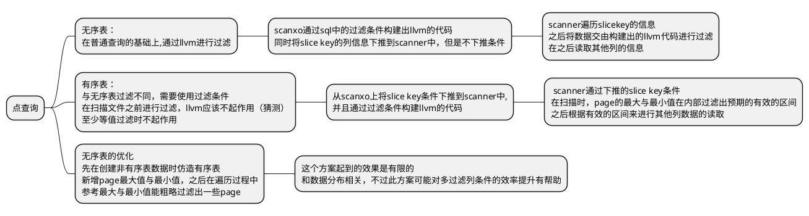
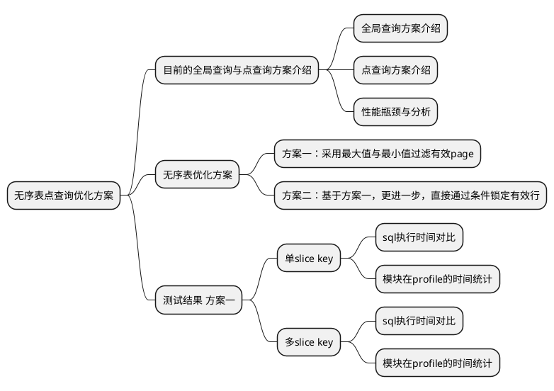
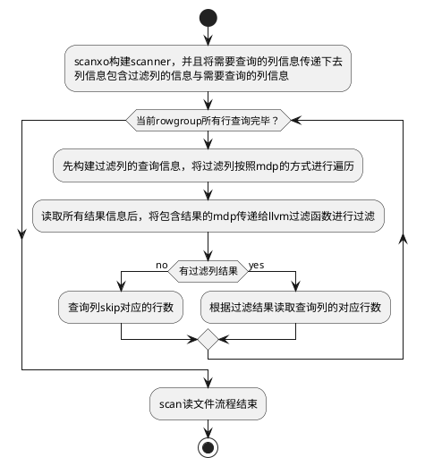
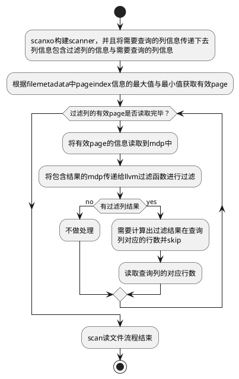

# **本文记录无序表点查询优化的实现方案与测试结果**

## **普通查询实现逻辑思维导图**

## **点查询的实现逻辑思维导图**

## **文档编写思维导图**

## **普通查询实现流程图(从scanxo开始)**

## **无序表点查询实现流程图(从scanxo开始)**

## **无序表点查询优化实现流程图(从scanxo开始)**

## **无序表点查询实现示意图**

```plantuml
@startsalt
{#
    Col1     |Col2     |Col3
    data1    |data2    |data3
    data1    |data2    |data3
    data1    |data2    |data3
    data1    |data2    |data3
    data1    |data2    |data3    
}

@endsalt
```
