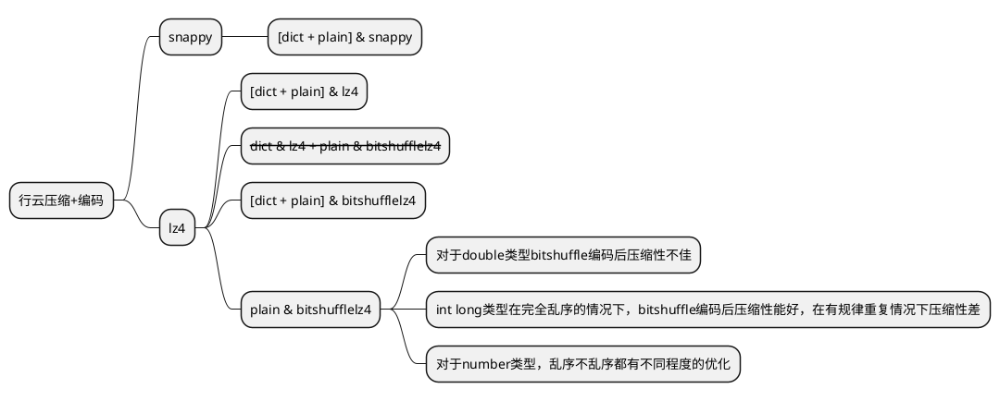

<!--
 * @FilePath: /东方国信工作资料/带有bitshuffle编码压缩调研/对于行云使用bitshuffle编码的想法.md
 * @Author: harpseal
 * @Date: 2023-02-17 16:57:36
 * @LastEditTime: 2023-02-28 10:30:19
 * @email: 844291270@qq.com
-->

思维导图

 
