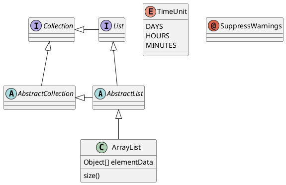
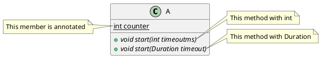

# vscode下载与安装

## vscode下载

国内访问外网可能下载比较慢，可以参考下面的网址中的解决方法：
```
https://zhuanlan.zhihu.com/p/112215618
```

首先在官网找到需要下载的文件，点击下载。

在浏览器或者下载软件中就可以看到这么一个下载地址了，将其复制下来（如下图箭头所指）。


然后将红框内的部分更换为如下内容：

vscode.cdn.azure.cn <--------就是左边这个

更新后的地址为：http://vscode.cdn.azure.cn/stable/78a4c91400152c0f27ba4d363eb56d2835f9903a/VSCodeUserSetup-x64-1.43.0.exe

这个就是国内的镜像了点开后你会发现速度直接起飞。


## vscode安装

### 软件安装

直接打开安装包安装就可以

### 插件列表

    1、Chinese (Simplified) Language Pack for Visual Studio Code
    2、c/c++
    3、plantuml
    4、Markdown
    5、Markdown plantuml preview
    6、vscode-pandoc
    7、Markdown pdf



