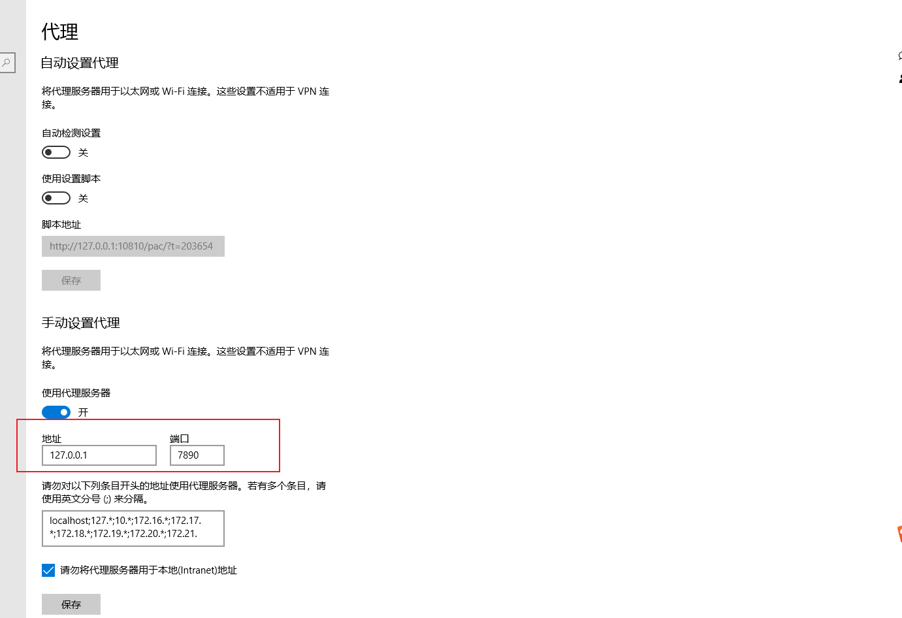

# **vscode 与 github 环境连接的搭建**

## 背景介绍

本人使用的是 window 下安装的 vscode 与 WSL 子系统搭配的方式来使用，所以与平常的 linux 或者 window 或者 mac 的使用都不太一样，特别是一些插件在 linux 下安装与在 WSL 子系统安装可能会有不同，所以应该不是很顺利，持续更新遇到的坑与时而高端但是大部分都猥琐的解决方案~~

## vscode 与 WSL 的安装

### vscode 的安装

在 win10 上安装 vscode 并安装一些插件，可以看之前的<<vscode 下载与安装>>

### WSL 的安装

安装好 vscode 之后，需要在 win10 上安装 WSL，在 window 下使用 WSL（Windows Subsystem for Linux）试是一个 linux 开发者的非常省事儿的环境配置的一个方式，不用虚拟机，不用双系统随用随开，能够与 window 上的文件系统互通（虽然 window 系统上的文件一并是 root 权限）。但是不耽误用，在安装环境的时候注意下一就可以了。

WSL 在微软的商城就能在线安装（不用登陆微软账户就可以安装），离线安装的方式暂时不弄，以后有需要再补充

## vscode 连接 WSL

安装了 WSL 使用插件 Remote-WSL 可以自动连接到 WSL 中，应该不需要其他操作（在 vscode 的远程资源管理时应该有提示是否连接到 WSL）。连接到 WSL 之后的操作就可以完全按照 linux 下的操作来了，hhh

## git 与 github

在搭建 vscode 使用 github 前需要先明确 git 与 github 的概念

### 什么是 git（个人理解）

git 是一个代码管理工具，可以本地搭建自己使用，完全可以自己在 linux 环境上搭建一个 git 仓库管理自己的代码或者一些文档

### 什么是 github（个人理解）

github 是一个网站，你可以把本地的 git 的内容同步到网络上，此外还可以使用 github 来查看其他开源优质的工程代码

### git 与 github（个人理解）

如果你只是想管理自己的代码或文档，给他们添加一个版本控制功能，那可以直接使用本地的 git（linux 是自带的，window 需要安装 git），如果你想让自己的代码可以在不同的地方随时查看与修改（有网），比如我如果在公司写了个文档，但是没有写完，回家想继续编辑，我原来的方法就是优盘或者微信什么的备份一下，之后再在家里电脑上继续修改，不是很方便。如果使用 git+github，在公司写了之后上传到 github 上，之后回家只要从远端拉下来就可以继续的写文档了。

## 搭建远端仓库并与本地仓库做关联

**以下的本地操作均在 WSL 的终端上或者 vscode 连接到 WSL 上之后的终端操作**

### 搭建远端仓库

首先你需要在 github 上有个账号，之后再在网页上建立一个仓库
可以参考[百度经验]，或者在网上搜索一下
<https://jingyan.baidu.com/article/c843ea0ba1110d77921e4a7e.html>

### 远端仓库与本地仓库做关联

- 检查 git 是否安装

```
git --version
```

如果没有安装就

```
sudo apt-get install git
```

- 确定 git 安装后，需要在远端 github 上添加 ssh 秘钥，这里认为本地 git 还没有与远端 github 建立过连接，首先要配置 git 的用户名和邮箱，在本地配置的 git 用户名与邮箱可以随意起名，格式正确就行

```
git config --global user.name 'username'
git config --global user.email 'youEmail'
e.g.
git config --global user.name 'lcz'  // 没有提示就是成功
git config --global user.email 'lcz@git.com'  // 没有提示就是成功
```

之后，再执行

```
ssh-keygen -t rsa -C "youEmail"
e.g.
ssh-keygen -t rsa -C "lcz@git.com"
```

如果遇到提示就一路回车，之后会在用户目录下生成.ssh 的隐藏文件夹

```
pachina@DESKTOP-R581VPJ:~$ ll .ssh
total 8
drwx------ 1 pachina pachina 4096 Mar 24 16:18 ./
drwxr-xr-x 1 pachina pachina 4096 Mar 25 14:14 ../
-rw------- 1 pachina pachina 2610 Mar 24 16:16 id_rsa
-rw------- 1 pachina pachina  578 Mar 24 16:16 id_rsa.pub
-rw-r--r-- 1 pachina pachina 1768 Mar 24 16:20 known_hosts
```

将 id_rsa.pub 中的一大堆内容复制之后，贴到 github 上的 ssh 秘钥区域就可以了

- 在远端添加了秘钥之后就可以开始关联远程库了

```
先删除以防其他链接占用
git remote rm origin
之后执行
git remote add origin lcz@git.com/lcz/nihao.git
上面的url地址是在github上建立远端仓库时的ssh地址，一般在下载代码时候就能看到
之后执行
git remote -v
如果有打印的话就是已经建立连接了，之后就可以使用vscode对文本进行提交
最后可以拉取代码
git pull + ssh地址
e.g.
git pull git@github.com:apache/impala.git
```

- 可以添加一些配置

```
如配置.gitignore等，文件相关的说明存放在 “学习笔记/git/配置文件/gitignore配置.md”
```

**需要注意：**

用 WSL 建立连接时，本地仓库要建立到 WSL 用户的根目录下，不能建立在 window 的文件系统下，否则建立连接之后提交会报权限不正确之类的问题。

## Window 下的 vscode 与 github 配置链接

### 安装 git

可以去官网下载安装 git 工具（应该可以全选默认安装）
安装之后需要修改记录一下 git 工具的环境变量
在Windows环境下可以使用
```
where git
```
查找git的安装路径
最后需要将 git 执行文件的路径配置到 setting.json 中，如

```
  "git.path": "C://Program Files/Git/bin/git.exe"
```

### 配置 ssh 相关

秘钥的生成与去 github 上配置流程与 linux 上的一样
配置完成后需要再在 vscode 的终端上输入

```
ssh -T git@github.com
输入 回车 yes
```

### clone 仓库

关联远程库可以直接操作 vscode 上的原代码关联部分
在进行 clone 的时候建议选择使用 ssh 的链接,如：

```
git clone git@github.com:HarpsealCC/note.git
```

### 可能存在的问题

#### clone 时报错

```
clone报错fatal: unable to access ‘https://github.com/...‘: Failed to connect to github.com port
```

可能是翻墙开代理时候修改了本机 ip 与端口，可以
1、在 Window 设置中找到代理，记录下代理的端口号

2、输入

```
git config --global http.proxy http://127.0.0.1:7890
git config --global https.proxy http://127.0.0.1:7890

// 注意ip与端口号要实时替换
```

可以参考https://blog.csdn.net/weixin_46191137/article/details/133739981
